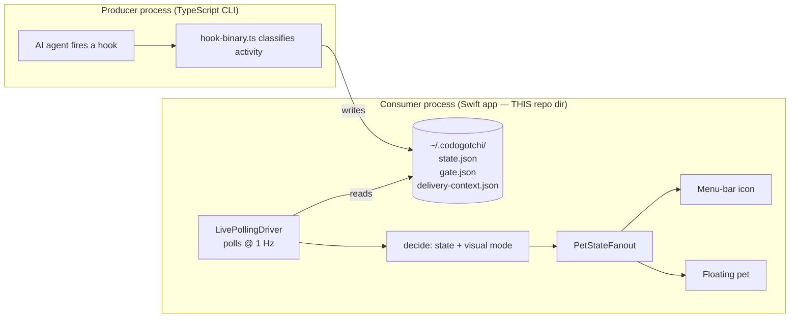

> Goal: by the end you can draw the entire data flow from memory and name every
> major file's single job. Each section ends with a 🗣️ **plain-English** recap —
> read those alone for the no-jargon version.

---

## What this app actually is

It's a **menu-bar agent** — a macOS app with no Dock icon and no main window,
just an icon in the top-right menu bar (and an optional floating pet sprite that
hovers over your desktop). It is configured that way by `LSUIElement = true` in
`Info.plist` and `app.setActivationPolicy(.accessory)` in
[`MenubarApp.swift:98`](https://github.com/cesarnml/codogotchi/blob/archive/v2.5.0/apps/menubar/Sources/MenubarApp.swift#L98).

🇹🇸 **TS analogy.** Think of an Electron tray app with no `BrowserWindow` — only
a `Tray` icon and maybe a transparent always-on-top window. Same shape, native.

🗣️ **In plain English.** Codogotchi isn't a "window" app at all — it's a tiny
icon that lives next to your clock, plus an optional cartoon pet that floats
over everything else. There's nothing to open, minimize, or close; it just sits
there and reacts.

---

## The core insight: it's downstream of a file

There are **two separate processes** in play, and conflating them is the #1
source of confusion:

1. **The producer** — the CLI hook (`packages/cli/src/hook-binary.ts`, written
   in **TypeScript**, your home turf). When you run Claude Code / Codex / Cursor
   etc., that agent fires hooks. The hook classifies "what is the agent doing
   right now" and **writes** `~/.codogotchi/state.json`.

2. **The consumer** — this Swift app. It **reads** that file once per second and
   renders it. It does *not* decide what the pet is doing; it only reflects what
   the producer wrote.



**The file on disk is the entire contract between the two processes.** That's
why Chapter 02 (the contract) matters so much, and why the v2 feature is framed
as a change to *that file's shape*, not as a Swift feature.

⚠️ **Gotcha for a TS dev.** There's no shared type between producer and consumer
at compile time — they're different languages, different processes. The "type"
is the JSON schema, enforced at runtime on both ends (Zod in TS, a hand-written
decoder in Swift). They are kept in lockstep *by convention and a version
number*, not by the compiler. See `[02]` for the version-lockstep gotcha.

🗣️ **In plain English.** Two separate programs never talk to each other
directly. One (your AI tool's hook) leaves a note on disk saying what's
happening; the other (the pet app) reads that note once a second and acts it
out. Everything you'll learn in this guide is either "how the note gets
written" or "how the note becomes a cartoon.

---

## The data flow, end to end

Here's the whole pipeline with the real file/function names. Read it once now;
each piece gets a full chapter.

```
  ~/.codogotchi/state.json            ← written by the TS hook (other process)
        │
        │  read once per second
        ▼
  StateJsonReader.read(at:)           → Result<StateSnapshot, StateReadError>
        │                               (parse + schema-version check)
        ▼
  LivePollingDriver.runTick()
        │  • decide(): apply gate elevation, revive window, heart decay
        │  • emit():   suppress no-op repaints (change-gating)
        ▼
  PetStateFanout.apply(state:visualMode:)
        ├──────────────► MenubarRenderer.update()      → menu-bar icon (1 static frame)
        └──────────────► FloatingPetController.apply()  → FloatingPetScene (animated)
                                                          + badges/HUD via side channels
```

Two things to notice now, because they shape everything later:

1. **The fan-out splits one signal to two render targets.** One is the menu-bar
   icon (a single static frame — too small to animate). The other is the
   floating pet (a real animation loop via SpriteKit).
   `PetStateFanout.swift` is *literally* the seam the v2 multi-pet feature
   extends — today it fans out to 2 fixed consumers; v2 makes the floating side
   into *N* pets keyed by platform.

2. **The "rich" signals bypass the fan-out.** Only the core `(activity state,
   visual mode)` pair goes through the fan-out to *both* targets. Extra signals
   — the attention bubble, the SoA gate badge, the platform-logo chip, and the
   RPG hearts/level — are pushed *only to the floating pet*, through separate
   callback "sinks" wired in `MenubarApp`. (You'll see these as
   `driver.applyAttention = …`, `driver.applyPlatform = …` etc. around
   [`MenubarApp.swift:301`](https://github.com/cesarnml/codogotchi/blob/archive/v2.5.0/apps/menubar/Sources/MenubarApp.swift#L301).)

🗣️ **In plain English.** The note on disk gets turned into pixels twice: a tiny
still image up in the menu bar (too small to animate) and the full animated pet
on your desktop. The basic "what is it doing" signal reaches both; all the
extras — speech bubbles, badges, hearts — only the big pet gets.

---

## Two different "states" — don't mix them up

The word "state" is overloaded in this codebase. There are **two distinct files
and two distinct concepts**:

| | `state.json` | `app-state.json` |
|---|---|---|
| **Written by** | the TS hook (producer) | the Swift app itself |
| **Contains** | what the *agent* is doing (activity, hearts, level) | what the *app/window* is doing (is the floating pet visible? where is its window? onboarding done? hook install status) |
| **Code** | `StateSnapshot` in [`ActivityState.swift`](https://github.com/cesarnml/codogotchi/blob/archive/v2.5.0/apps/menubar/Sources/ActivityState.swift) | `FloatingAppState` in [`AppState.swift`](https://github.com/cesarnml/codogotchi/blob/archive/v2.5.0/apps/menubar/Sources/AppState.swift) |
| **Polled?** | yes, 1 Hz | no, read at launch + written on change |

🇹🇸 **TS analogy.** `state.json` is like a server-sent feed you subscribe to.
`app-state.json` is like `localStorage` — your own UI preferences you persist
between launches. Both happen to be JSON files; they are unrelated in purpose.

This distinction matters for v2: per-platform multi-pet changes the shape of
**`state.json`** (the activity feed — many platforms now) *and* needs
**`app-state.json`** to remember a window position **per pet** instead of one.

🗣️ **In plain English.** Two files share the word "state" and mean totally
different things: one is *the pet's diary* ("my human's AI is busy coding"),
the other is *the app's own notebook* ("the pet window sits at these
coordinates, the user finished onboarding"). Mixing them up is the classic
first-week confusion.

---

## The cast of characters (one line each)

Skim this; you'll meet them properly later. Grouped by job.

**Reading the contract**
- `ActivityState.swift` — the closed enum of ~25 activity states + `StateSnapshot` (the decoded file).
- `StateJsonReader.swift` — turns the JSON bytes into a `StateSnapshot` or a typed error.
- `GateJsonReader.swift` — reads the SoA `gate.json`; can *elevate* the hook's state to a more reliable gate state.

**The loop**
- `LivePollingDriver.swift` — the 1 Hz heartbeat. Read → decide → emit. The brain of the consumer side.
- `HalfHeartDecayEngine.swift` — pure function: given last-activity time and now, how many hearts to *display*.
- `DemoCycleDriver.swift` / `DemoConfig.swift` — replaces live polling with scripted fixtures for demos/screenshots.
- `TransitionLog.swift` — append-only NDJSON log of state changes (diagnostics).

**Turning state into pixels**
- `PetStateFanout.swift` — fan one `(state, mode)` to the menu-bar + floating renderers.
- `MenubarRenderer.swift` — paints one static hero frame into the menu-bar icon.
- `CodexPet.swift` / `CodogotchiPet.swift` — load spritesheets and slice per-state animation frames.
- `FloatingPetController.swift` — owns the floating panel's *lifecycle* (show/hide, persistence, screen changes).
- `FloatingPetPanel.swift` — the floating window itself + every badge/chip/HUD that decorates it (the big file).
- `FloatingPetScene.swift` — the SpriteKit scene that actually animates the sprite frames.
- `AttentionBubblePanel.swift`, `RPGHUDPanel.swift` — the speech-bubble and the hearts/XP HUD.
- `PlatformAttribution.swift` — maps `"claude_code"` → the Claude logo chip. **★ central to v2.**

**Wiring & app shell**
- `MenubarApp.swift` — composition root; constructs and connects everything at launch.
- `AppState.swift` — `app-state.json` persistence (window pos, visibility, hook status).
- `MenubarMenu.swift` — the dropdown menu when you click the icon.
- `SettingsWindowController.swift`, `OnboardingWindowController.swift` — the settings & first-run windows.
- `PetConfig.swift`, `ConfigBootstrap.swift`, `PetStoreSeeder.swift` — config + first-run asset seeding.

Everything ending in `…ViewModel.swift` is a plain data/logic struct backing a
settings tab — testable, no AppKit. Ignore them until you care about Settings.

🗣️ **In plain English.** Roughly twenty files matter, in four gangs: the ones
that *read the note* (the contract), the one that *checks it every second*
(the loop), the ones that *draw* (renderers), and the glue that *wires it all
up at launch*. Every other file hangs off one of those four jobs.

---

## 🧪 Prove it to yourself

1. **Find the heartbeat.** Open `LivePollingDriver.swift`, find `start()`
   ([line 166](https://github.com/cesarnml/codogotchi/blob/archive/v2.5.0/apps/menubar/Sources/LivePollingDriver.swift#L166)). Confirm
   the `Timer` fires `runTick` every `tickInterval` (default `1.0` s). This is
   *the* loop.

2. **Find the fork.** Open `MenubarApp.swift` around
   [line 228](https://github.com/cesarnml/codogotchi/blob/archive/v2.5.0/apps/menubar/Sources/MenubarApp.swift#L228) and read the
   `PetStateFanout(...)` construction. Identify the two closures: one updates
   `renderer` (menu bar), one updates `floatingPetController` (floating pet).
   That's the fan-out from the diagram, in real code.

3. **See the file the whole app is about.** In a terminal:
   ```
   cat ~/.codogotchi/state.json | python3 -m json.tool
   ```
   (Run an agent first if it's empty.) Everything in Chapter 02 is describing
   the shape you just printed.

➡️ Next: [02 — The data contract](./02-the-data-contract.md).
