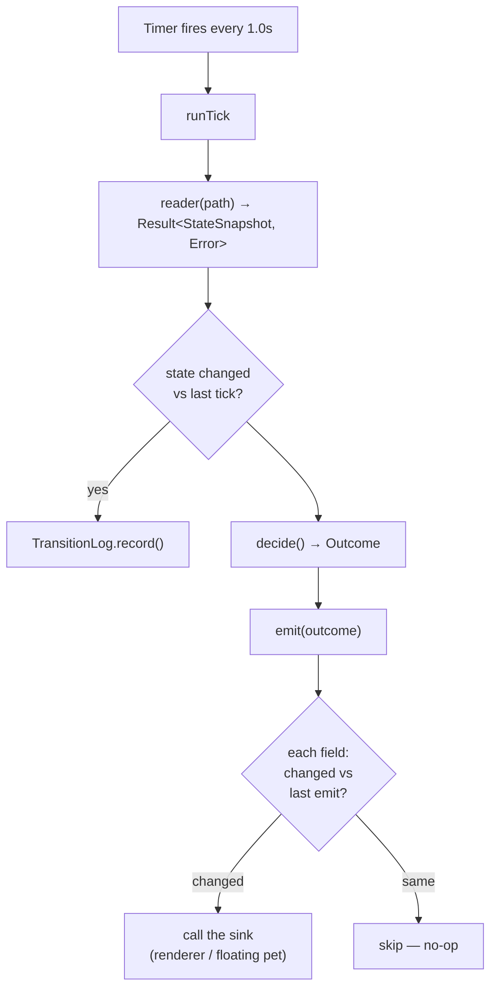

> Goal: trace one tick of `LivePollingDriver` from disk read to pixels, and
> understand the three "smart" transforms it applies (gate elevation, revive
> window, heart decay) plus the change-gating that keeps it cheap.

File: [`LivePollingDriver.swift`](https://github.com/cesarnml/codogotchi/blob/archive/v2.5.0/apps/menubar/Sources/LivePollingDriver.swift)
(538 lines). This is the brain of the consumer side.

---

## The shape of the loop



Two-stage design, very FP-friendly:

1. **`decide(...)` is (almost) pure.** It takes the read result + any preview
   overrides and returns a single immutable `Outcome` value — the complete
   description of what *should* be on screen this tick. No side effects, no
   AppKit. You could unit-test it with plain values (and the tests do).
2. **`emit(outcome)` is the impure part.** It compares each field of the
   `Outcome` to what it last sent and only calls the downstream sink **when that
   field changed**. This is the "change-gating."

🇹🇸 **TS analogy.** `decide` is your reducer: `(readResult) => Outcome`.
`emit` is a memoized dispatch layer — like `useEffect` deps or a `distinctUntilChanged`
in RxJS — that fires the side effect only when the value actually changed.

🗣️ **In plain English.** Once a second the app does two things, strictly in
order: *make up its mind* about what should be on screen (pure thinking, no
drawing), then *touch the screen* — but only for the parts that actually
changed since last time. Keeping "deciding" and "doing" separate is why the
loop is easy to test and cheap to run.

---

## One tick, line by line

`runTick()` ([line 202](https://github.com/cesarnml/codogotchi/blob/archive/v2.5.0/apps/menubar/Sources/LivePollingDriver.swift#L202)):

```swift
private func runTick() {
    let previewState = …                       // dev override files, ignore in prod
    let result = reader(pollingTargetPath)      // ← read state.json → Result
    if case .success(let snapshot) = result {   // record transitions for the log
        if lastAgentState != snapshot.activityState {
            transitionLog?.recordTransition(…)
        }
        lastAgentState = snapshot.activityState
    }
    let outcome = decide(from: result, …)       // ← pure decision
    emit(outcome)                               // ← gated side effects
}
```

🗣️ **In plain English.** "Read the file. If the agent's state changed since last
time, jot it in the log. Decide what should be on screen. Push only the bits
that changed to the screen." That's the entire heartbeat.

---

## `decide()` — the three smart transforms

On a successful read, `decide` doesn't just pass the snapshot through. It applies
three layered transforms ([lines 256–295](https://github.com/cesarnml/codogotchi/blob/archive/v2.5.0/apps/menubar/Sources/LivePollingDriver.swift#L256)):

### 1. Gate elevation
```swift
let resolved = resolveActivityState(gate: gate, hookState: snapshot.activityState, …)
```
If `gate.json` says SoA is in a known phase (e.g. red-TDD, open-PR), that
*reliable* state overrides the *heuristic* hook state. The hook guesses from
tool calls ("looks like editing"); the gate *knows* ("we are in the review
phase"). Gate wins.

🗣️ **In plain English.** Two sources of truth about what the agent is doing; the
trustworthy one (SoA's own signal) beats the inferred one.

### 2. Revive window
```swift
let state = resolveReviveState(base: resolved, reviveUntil: snapshot.reviveUntil, …)
```
If the pet just *gained* a half-heart, `revive_until` is set to ~5s in the
future. While that window is open, play the celebration animation, overriding
everything else. After 5s it lapses and falls back to `resolved`.

🗣️ **In plain English.** "You just healed — do a little happy dance for 5 seconds,
then go back to whatever you were doing."

### 3. Heart decay (display-only)
```swift
let displayedHalfHearts = HalfHeartDecayEngine.displayed(
    written: snapshot.halfHearts,
    lastActivityAt: …, now: now())
```
The file says "6 hearts as of `last_activity_at`." But if hours have passed with
no new write, the pet should *look* sicker now. The decay engine computes the
*displayed* hearts from wall-clock elapsed time. Crucially:

> The writer is authoritative on *heals*; Swift only ever **decays**, never
> invents heals.

🗣️ **In plain English.** Health only goes *down* on the Swift side, based on real
elapsed time, so a pet left alone visibly wilts even though no new file was
written. Healing must come from the producer. And because the 1 Hz poll
recomputes decay every tick against `now`, **the poll loop itself is the decay
timer** — no separate timer needed, and waking from sleep instantly shows the
true (decayed) value.

⚠️ **Gotcha.** This is why there are *two* heart numbers: `snapshot.halfHearts`
(written, authoritative) and `displayedHalfHearts` (what you see). Don't confuse
them when debugging "hearts look wrong."

The result of all three is bundled into one immutable `Outcome` struct
([line 221](https://github.com/cesarnml/codogotchi/blob/archive/v2.5.0/apps/menubar/Sources/LivePollingDriver.swift#L221)) carrying
state, visual mode, tooltip, attention, gate badge, and RPG numbers.

---

## `emit()` — change-gating, field by field

The renderer must not be poked 1×/second with the same value (wasteful, and on
the menu bar it'd cause flicker). So `emit` keeps a cached "last emitted" value
for **each** channel and only fires the sink on a real change
([lines 373–447](https://github.com/cesarnml/codogotchi/blob/archive/v2.5.0/apps/menubar/Sources/LivePollingDriver.swift#L373)):

```swift
let renderChanged = lastRendered == nil || prior.state != new.state || prior.mode != new.mode
if renderChanged {
    apply(outcome.state, outcome.mode)   // ← the fan-out closure
    lastRendered = (outcome.state, outcome.mode)
}
// …same pattern repeated for: tooltip, attention, gateBadge, platform, rpgState
```

Notice the repeated `hasEmitted…` boolean flags. They exist to distinguish "I
have *never* emitted" from "the current value is nil." The very first emit must
fire even if the value is nil (to clear any inherited placeholder); later
identical nils are suppressed.

🇹🇸 **TS analogy.** Each channel is its own `distinctUntilChanged`. The
`hasEmitted` flag is the difference between a stream that hasn't produced its
first value yet and one whose first value happens to be `null` — you've hit this
exact subtlety with RxJS `BehaviorSubject` vs `Subject`.

🗣️ **In plain English.** The app remembers what it last told each part of the
screen, and stays silent when nothing changed — otherwise the menu-bar icon
would flicker once a second for no reason. One subtlety: the very *first*
message always goes through, even if it's "nothing to show," so leftover
placeholders get cleared.

### The sinks — where v2 plugs in

`emit` calls these closures (set in `MenubarApp`):

| Channel | Sink | Goes to |
|---|---|---|
| `(state, mode)` | `apply` | **fan-out** → menu bar **and** floating pet |
| `tooltip` | `setTooltip` | the menu-bar status item tooltip |
| `attention` | `applyAttention` | floating pet only (speech bubble) |
| `gateBadge` | `applyGateBadge` | floating pet only |
| `platform` (`source_event.origin`) | `applyPlatform` | floating pet only (logo chip) |
| `rpgState` | `applyRPGState` | floating pet only (HUD) |

★ **The `applyPlatform` channel already extracts `source_event.origin` and
pushes it to the floating pet** to pick the platform logo chip
([line 421](https://github.com/cesarnml/codogotchi/blob/archive/v2.5.0/apps/menubar/Sources/LivePollingDriver.swift#L421)). In v1 it
just decorates the single pet. In v2, `origin` becomes the **routing key** that
decides *which* pet gets the update. The plumbing to read the key already exists;
v2 changes what you *do* with it.

---

## Why a `Timer`, and the wake-from-sleep trick

- `start()` runs one tick immediately (so the UI isn't blank for a second) then
  schedules a repeating `Timer` at `tickInterval`.
- `tickForTesting()` / `pollNow()` are seams to run a single tick synchronously —
  tests use the former (no real wall-clock waits); `pollNow()` is called by the
  **wake-from-sleep** observer in `MenubarApp` so the pet refreshes instantly on
  wake instead of waiting up to a second.
- The `Timer` naturally pauses while the Mac sleeps, so no sleep handler is
  needed — only a wake handler.

🇹🇸 **TS analogy.** `Timer.scheduledTimer(repeats:)` is `setInterval`.
`tickForTesting()` is exposing the interval's callback so tests call it directly
instead of using fake timers — same goal as `jest.advanceTimersByTime`, done by
hand for determinism.

🗣️ **In plain English.** The heartbeat is an ordinary once-a-second timer. It
naturally stops while your Mac sleeps, and the one special case is waking up:
the app immediately takes a fresh look instead of showing a stale pet for a
second.

---

## 🧪 Prove it to yourself

1. **Separate decide from emit.** In `LivePollingDriver.swift`, confirm `decide`
   returns an `Outcome` and touches no UI, while every actual UI call lives in
   `emit`. Why is this split valuable for testing? (Because `decide` is pure —
   feed it a `Result`, assert the `Outcome`, no AppKit.)

2. **Predict a no-op.** The agent stays `implementing` for 30 seconds (30 ticks).
   How many times does the menu-bar `apply` closure fire? (Once — the first tick;
   the other 29 are change-gated away. But `rpgState`/decay *may* fire if a heart
   boundary is crossed.)

3. **Find the v2 routing key.** Locate the `applyPlatform` block in `emit`.
   `outcome.sourceEvent?.origin` is the string (`"claude_code"`, `"cursor"`…).
   In v2, imagine this line not as "decorate the pet" but as "look up which pet."
   That reframe is the entire feature.

➡️ Next: [04 — The renderers](./04-the-renderers.md).
