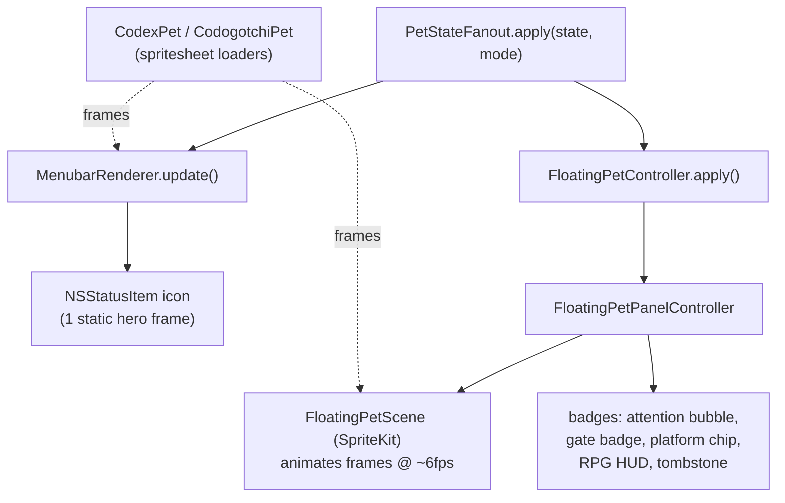

> Goal: understand how a `(state, mode)` pair becomes pixels, on both targets;
> the spritesheet/pet model; and SpriteKit's role. After this you'll know which
> render code v2 duplicates per-platform.

🗣️ **In plain English.** This chapter is about the last step: a mood becoming
pixels. The same mood is drawn twice — once as a tiny still picture by the
clock, once as the animated desktop pet — and all the artwork comes from
"sprite sheets": big picture-grids where each row is one animation, like a
flip-book per mood.

There are **two render targets**, fed by the fan-out:

1. **The menu-bar icon** — `MenubarRenderer`. One small static frame. No motion.
2. **The floating pet** — `FloatingPetController` + `FloatingPetPanel` +
   `FloatingPetScene`. A real animation loop, plus badges and a HUD.



---

## The fan-out itself

[`PetStateFanout.swift`](https://github.com/cesarnml/codogotchi/blob/archive/v2.5.0/apps/menubar/Sources/PetStateFanout.swift) is
tiny (26 lines) and worth reading whole:

```swift
@MainActor
final class PetStateFanout {
    typealias Apply = (ActivityState, VisualMode) -> Void
    private let applyToMenubar: Apply
    private let applyToFloatingPet: Apply

    func apply(state: ActivityState, visualMode: VisualMode) {
        applyToMenubar(state, visualMode)
        applyToFloatingPet(state, visualMode)
    }
}
```

🗣️ **In plain English.** "Take one state; hand it to the menu bar, then to the
floating pet." That's it. It holds two functions and calls both.

🇹🇸 **TS analogy.** `const fanout = (s) => { toMenubar(s); toFloating(s); }`. The
`typealias Apply` is just `type Apply = (s: ActivityState, m: VisualMode) => void`.

★ **This is the v2 extension point.** Today `applyToFloatingPet` targets *one*
floating controller. v2 turns the floating side into a keyed set — "hand the
`claude_code` slice to the Claude pet, the `cursor` slice to the Cursor pet."
The fact that a fan-out *abstraction already exists* is what makes v2 a bolt-on
rather than a rewrite.

---

## The pet/spritesheet model

A "pet" is **one big image (a spritesheet) sliced into a grid of frames**. Each
*row* is one animation; each *column* a frame in that animation.

### `CodexPet` — one sheet, 8×9 grid
[`CodexPet.swift`](https://github.com/cesarnml/codogotchi/blob/archive/v2.5.0/apps/menubar/Sources/CodexPet.swift). Loads
`pet.json` + a WebP sheet, validates it's exactly 8 columns × 9 rows, and exposes
a hardcoded `ActivityState → RowSpec` map:

```swift
static let rowMap: [ActivityState: RowSpec] = [
    .idle:         RowSpec(rowIndex: 0, frameCount: 8),
    .implementing: RowSpec(rowIndex: 7, frameCount: 6),
    .thinking:     RowSpec(rowIndex: 8, frameCount: 4),
    // …
]
```

`frames(for:)` slices the row's columns into individual `NSImage`s (one per
frame). 🇹🇸 **TS analogy:** `RowSpec` is `{ rowIndex: number, frameCount:
number }`; `[ActivityState: RowSpec]` is a `Record<ActivityState, RowSpec>`
(a `Map`, technically — Swift dictionary).

### `CodogotchiPet` — three tiered sheets
[`CodogotchiPet.swift`](https://github.com/cesarnml/codogotchi/blob/archive/v2.5.0/apps/menubar/Sources/CodogotchiPet.swift) holds
up to **three** sheets and resolves a state by trying them in order:

1. **SoA sheet** (`soaRowMap`) — the premium delivery-gate animations.
2. **Lite-Enhanced sheet** — richer hook-state art.
3. **Lite-Basic sheet** — the always-present baseline.

`frames(for:)` returns the first sheet that has art for the requested state, else
an empty array.

🗣️ **In plain English.** "Use the fanciest art available for this state; fall back
to plainer art; if nothing has it, return nothing." Missing sheets are
soft-degraded — `init` still succeeds, the pet just renders fewer states.

### Resolution across both pets (the renderer's job)
`MenubarRenderer.resolveFrames(for:)`
([line 125](https://github.com/cesarnml/codogotchi/blob/archive/v2.5.0/apps/menubar/Sources/MenubarRenderer.swift#L125)) layers them:

```
CodogotchiPet (SoA → Lite-Enhanced → Lite-Basic)   ← try first
   ↓ empty?
CodexPet (the codex sheet)                          ← fallback
   ↓ empty?
CodexPet .idle frames                               ← final safety net
```

🗣️ **In plain English.** Three tiers of "do we have good art for this exact state?",
ending in "show idle rather than nothing." This is the same forgiving-degradation
instinct as `unknown → idle` in Chapter 02, now at the *art* layer.

---

## Render target A: the menu bar (static)

[`MenubarRenderer.swift`](https://github.com/cesarnml/codogotchi/blob/archive/v2.5.0/apps/menubar/Sources/MenubarRenderer.swift).
Key facts:

- It paints **one static "hero" frame** per state (`heroFrameIndex = 3`), **not
  an animation**. The 22pt menu-bar icon is too small for motion to read.
- It's driven entirely by external `update(state:visualMode:)` calls. It never
  reads `state.json` — that's the loop's job. Clean separation of concerns.
- `VisualMode.desaturated` runs the frame through a Core Image grayscale filter —
  that's the "failure" look (gray pet = something's wrong upstream).
- It's change-gated again internally: `update` is a no-op if the resolved
  (state, mode) equals the last painted pair.

🇹🇸 **TS analogy.** A pure-ish component: `update(props)` → if props changed,
recompute the image and call `sink(image)`. `sink` is dependency-injected
(`statusItem.button.image = $0` in prod, a capture array in tests) — the React
equivalent of passing a render callback instead of importing the DOM.

🗣️ **In plain English.** The menu-bar icon is deliberately boring: one still
frame per mood, swapped only when the mood changes, turned gray when the app
can't trust its data. All the liveliness lives in the floating pet.

---

## Render target B: the floating pet (animated)

Three collaborating types — keep their jobs distinct:

### `FloatingPetController` — lifecycle
[`FloatingPetController.swift`](https://github.com/cesarnml/codogotchi/blob/archive/v2.5.0/apps/menubar/Sources/FloatingPetController.swift)
(185 lines). Owns **whether and where** the floating pet exists:
- show / hide, and **persist** that choice + the window frame to `app-state.json`.
- re-clamp the window when the screen layout changes (monitor unplugged, etc.).
- forwards `apply(state:)`, `applyAttention`, `applyRPGState`, … straight to the
  panel.

🗣️ **In plain English.** The controller is the *stage manager*: it decides if the
pet is on stage and remembers where it stood; it doesn't do the acting.

### `FloatingPetPanelController` (in `FloatingPetPanel.swift`) — the window + decorations
[`FloatingPetPanel.swift`](https://github.com/cesarnml/codogotchi/blob/archive/v2.5.0/apps/menubar/Sources/FloatingPetPanel.swift)
(2,647 lines — the big one). It owns:
- the transparent always-on-top `NSPanel` window,
- the SpriteKit scene inside it,
- **and every decoration**: the attention speech bubble, the SoA gate badge, the
  animation-label badge, the **platform-logo chip**, the RPG HUD (hearts/XP), the
  tombstone + revive meter when the pet is "dead."

🗣️ **In plain English.** This is the *set* and all the *props*: the window frame, the
sprite, and every little label/icon hovering around the pet.

⚠️ **Gotcha / why it's huge.** This one file fuses the controller, two badge
panel types, the mouse-interaction policy (drag direction, click-hold), and the
hide-prompt into one module. It's the *only* file in the app that genuinely wants
splitting, and v2 (which reopens it heavily) is the moment to do it. Don't try to
hold all 2,647 lines at once — find the section you need via the type list:
`FloatingPetPanelController` (the controller, ~lines 5–700), `GateBadgePanel`,
`AnimationBadgePanel`, `FloatingInteractionPolicy`.

### `FloatingPetScene` — the animation loop
[`FloatingPetScene.swift`](https://github.com/cesarnml/codogotchi/blob/archive/v2.5.0/apps/menubar/Sources/FloatingPetScene.swift)
(1,026 lines). A **SpriteKit** `SKScene` — Apple's 2D game framework.

🇹🇸 **TS analogy.** This is your `<canvas>` with a `requestAnimationFrame` loop.
It owns a frame timer, advances `frameIndex`, swaps the sprite texture, and also
handles "live" concerns the static menu bar doesn't: **idle escalation** (pet
gets impatient → frustrated the longer you ignore it), **sickness** tint,
**ghosting** (grayscale when dead), and **mouse interactions** (running
left/right while dragged, jumping on click-hold).

⚠️ **Gotcha.** Don't "split up the render loop." A tight per-frame `update()`
loop and the sprite state it mutates belong together — same reason you wouldn't
shatter a `requestAnimationFrame` across files. This file's size is mostly
justified; `FloatingPetPanel`'s is not.

🗣️ **In plain English.** Three actors share the floating pet's job: a *stage
manager* (is the pet on screen, and where), a *set builder* (the window and
every badge and bubble around the pet), and an *animator* (the game engine
flipping frames, making her fidget when ignored and jump when clicked).

---

## VisualMode and the failure look

[`MenubarRenderer.swift:13`](https://github.com/cesarnml/codogotchi/blob/archive/v2.5.0/apps/menubar/Sources/MenubarRenderer.swift#L13):

```swift
enum VisualMode: Equatable { case normal; case desaturated }
```

`.desaturated` is the "I can't trust the data" visual (file malformed / schema
too new). It's a *mode*, not a separate pet pose — the same frames, run through a
grayscale filter. The floating pet has a richer version of this idea (sickness
levels, ghosting) but the principle is the same: degrade the *look*, keep the
*pose*.

🗣️ **In plain English.** When something upstream is broken, the pet doesn't
vanish or crash — it goes grayscale, like a TV losing color. Same pose, drained
look: instantly readable as "something's wrong with my data" without a single
error dialog.

---

## 🧪 Prove it to yourself

1. **Trace one state to two looks.** Pick `.implementing`. In `MenubarRenderer`
   it becomes *one* static hero frame. In `FloatingPetScene` it becomes an
   *animated* cycle of that row's frames. Same input, two render strategies —
   articulate why (size/legibility).

2. **Find the tier fallback.** In `MenubarRenderer.resolveFrames`, follow the
   three `if !…isEmpty` branches. Construct a state that exists only in the Codex
   sheet (not Codogotchi) and predict which branch wins.

3. **Locate the v2 seam in the renderer.** In `PetStateFanout`, the
   `applyToFloatingPet` closure currently points at one controller. Sketch (in a
   comment, don't implement) what it would mean for that to become
   `applyToFloatingPet[origin]` — a dictionary of controllers keyed by platform.
   You've just designed the core of v2's render side.

➡️ Next: [05 — Swift & AppKit for a TS/FP dev](./05-swift-and-appkit-for-ts-devs.md).
