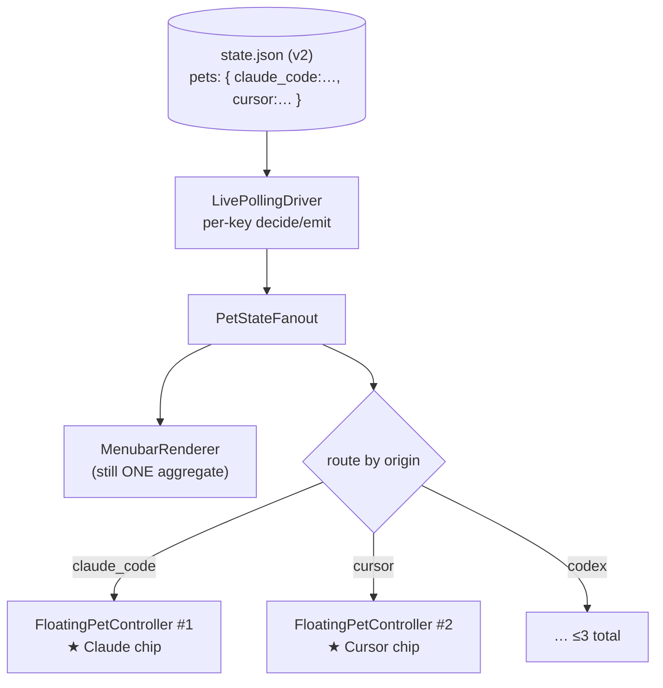

> Goal: connect everything you've read to the committed v2 feature, and point at
> the exact code each part touches. After this you should be able to scope the
> work yourself.

> 📜 **Historical note.** This chapter was written *before* v2 shipped and is
> kept as the design-time snapshot (the plan, and the reasoning behind it).
> v2 has since landed — for the architecture as actually built (state.d
> slices, the window pool, session lifecycle) continue to
> [Chapter 09](/09-v2-as-built/), and for the critical read that motivates the
> v3 consolidation work, [Chapter 10](/10-the-seams-v3-redesign/).

Source design docs (read alongside this):
- `notes/private/codogotchi-v2-per-platform-floating-pets.md` — the design.
- `notes/private/phase-12-cleanup-and-v2-roadmap-synthesis.md` — sequencing;
  multi-pet is **Phase 12 item #1, the firm directive**.

---

## The feature in one line

> Today: **one** floating pet showing the *aggregate* "what's my agent doing."
> v2: **one floating pet per active agent platform** (Claude Code, Codex, Cursor,
> …), user-configurable — so you see all your running agents at once instead of
> one clobbered signal.

"Active" = the platform's hooks are alive (the app is running), not necessarily
busy. An idle-but-running platform shows its pet in `idle`. No new "asleep"
concept needed — `idle` already covers it.

---

## The crux: "don't build multiple pets — give `state.json` a key"

This is the whole insight, and it's why the earlier chapters spent so long on the
contract. Recall from Chapter 02:

> `state.json` is a **single scalar aggregate** — one `activity_state`, one
> `source_event.origin`. The producer overwrites the whole file each event, so
> concurrent agents last-writer-wins clobber each other.

The hard 80% of v2 is turning that scalar into a **collection keyed by
platform**:

```jsonc
// today (v1, schema 6) — one pet
{ "activity_state": "implementing", "source_event": { "origin": "claude_code" }, … }

// v2 (schema 7) — N pets, keyed by origin
{
  "schema_version": 7,
  "pets": {
    "claude_code": { "activity_state": "implementing", "half_hearts": 6, … },
    "cursor":      { "activity_state": "idle",         "half_hearts": 4, … }
  }
}
```

Once state is keyed, the renderer's **existing fan-out** (Chapter 04) makes ≤3
floating panels fall out fairly naturally. The window-spawning is the easy ~20%.

⚠️ **The design rule that avoids a double rewrite** (from the note): key the v2
schema so it can later extend from `[origin]` → `[origin, session_id]`. v2 is
per-*platform*; a possible v3 is per-*thread*. If you shape the key as a single
opaque string today, per-thread becomes "use a richer key" rather than another
schema migration. **Design the key for extension even though you only populate
platform now.**

---

## Blast radius, by layer

Three layers, in dependency order. The first two are TypeScript (your home turf);
the third is the Swift you just learned.

### Layer 1 — `packages/contracts` (TypeScript, public surface)
`packages/contracts/src/state-json.ts`. Turn the flat schema into a
platform-keyed collection; **bump `STATE_JSON_SCHEMA_VERSION` to 7**. This is a
*public* contract (treated as if users depend on it) so it's a real version bump,
not a quiet shim. The Zod schema is where you encode the `[origin]`-keyed shape.

### Layer 2 — `packages/cli/src/hook-binary.ts` (TypeScript, the producer)
Each hook writes **its own platform slice** instead of overwriting the whole
file. `CODOGOTCHI_ORIGIN` already carries the platform discriminator, so the
producer already *knows* its own identity — it just needs to write to
`pets[origin]` rather than the root. **This actually improves v1 correctness**:
today two agents clobber each other; keyed writes stop that.

⚠️ Concurrency note: N processes now read-modify-write the *same* file to update
*different* keys. You'll need an atomic merge (read, set your slice, atomic
write) or per-slice files. This is the genuinely fiddly producer-side bit — flag
it early.

### Layer 3 — the Swift renderer (this app)
Walk the pipeline you now know, top to bottom:

| Pipeline stage | File | v2 change |
|---|---|---|
| Schema constant | `StateJsonReader.swift:8` | bump `EXPECTED_STATE_SCHEMA_VERSION` to 7 (**lockstep with Layer 1** — Ch.02 gotcha) |
| Decode | `ActivityState.swift` (`StateSnapshot`) + `StateJsonReader.swift` | `StateSnapshot` becomes (or is wrapped by) a keyed collection: `[origin: StateSnapshot]`. The reader parses the `pets` map. |
| The loop | `LivePollingDriver.swift` | `decide`/`emit` go per-key. The change-gating caches (`lastRendered`, `lastRPGState`, …) become **per-platform** caches. `applyPlatform` stops being "decorate" and becomes "route." |
| Fan-out | `PetStateFanout.swift` | `applyToFloatingPet` becomes keyed — route each platform's slice to its own controller. ★ the central seam. |
| Floating lifecycle | `FloatingPetController.swift` | from one controller to **N**, one per active platform; spawn/despawn as platforms appear/vanish. |
| Floating window + chip | `FloatingPetPanel.swift` | the platform chip (`applyPlatform`) becomes per-pet identity, badged top-left. **Split this file as the first commit** (Ch.04). |
| Platform identity | `PlatformAttribution.swift` | already maps `origin → logo`. Largely reused as-is — it's the lookup the routing needs. ★ |
| Window persistence | `AppState.swift` (`FloatingAppState`) | remember a frame **per platform**, not one. Likely an `app-state.json` schema bump too. |
| Spatial layout | new / `FloatingPetPanel.swift` | don't stack pets on top of each other — needs a small layout policy. New sub-problem. |

**Menubar stays single.** `MenubarRenderer` does *not* fan out — multiple
menu-bar pets is undesirable real-estate-wise. It keeps showing one aggregate,
switching which pet/state it renders on the latest transition from any platform.
So Layer 3's churn is **confined to the floating side**. That's the whole point
of keeping the menu bar singular.



---

## Why this is a bolt-on, not a rewrite (the steelman of the plan)

- **The key already exists in the data** — `source_event.origin` flows through
  the whole pipeline today (Ch.03's `applyPlatform` channel). You're not
  inventing identity; you're routing on an identity that's already present.
- **The fan-out abstraction already exists** — `PetStateFanout` was built to
  split one signal to many consumers. Going from 2 consumers to "menu bar + N
  floating" is its natural extension.
- **`PlatformAttribution` already maps origin → platform** — the per-pet badge is
  a solved lookup.
- **Bounded N (~3).** Claude / Codex / Cursor. No unbounded churn, trivial
  lifecycle (a platform is running or gone), no per-thread TTL swamp.

The honest hard parts: (1) the schema migration done in lockstep across three
files; (2) concurrent slice writes in the producer; (3) per-platform window
layout/persistence so pets don't overlap. None of these is architectural risk —
they're known, scoped work.

---

## Suggested order of attack

1. **First commit, before any feature code:** split `FloatingPetPanel.swift` —
   lift `FloatingInteractionPolicy` / `HitTarget` and the badge panels into their
   own files. You're about to reopen this file heavily; pay the cleanup down on
   code you're already touching (this is the Phase 12 "refactor toward v2" rule).
2. **Schema (Layer 1) + the lockstep Swift constant + decode (Layer 3 top).**
   Get a v2 file parsing into a keyed `StateSnapshot` collection, behind the
   version bump. Nothing renders differently yet.
3. **Producer (Layer 2)** — keyed slice writes with atomic merge. Now real
   multi-agent data lands on disk.
4. **Routing (fan-out → N controllers)** — the visible feature.
5. **Polish:** spatial layout, spawn/despawn animation, per-platform persistence.

---

## 🧪 Prove it to yourself (capstone)

1. **Find the key, end to end.** Trace `source_event.origin` from
   `state-json.ts` (Zod `sourceEventOriginSchema`) → `SourceEvent.origin` in
   `ActivityState.swift` → `outcome.sourceEvent?.origin` in
   `LivePollingDriver.emit` → `applyPlatform` → `PlatformAttribution(origin:)`.
   This single string's journey *is* v2's skeleton.

2. **Name the lockstep trio.** Without looking: which three edits must ship
   together to bump the schema to 7? (Zod `STATE_JSON_SCHEMA_VERSION`; Swift
   `EXPECTED_STATE_SCHEMA_VERSION`; Swift `StatePayload`/`StateSnapshot` decode.)
   Forgetting one grays out the pet.

3. **Spot the design-for-extension choice.** Explain why keying as a single
   opaque string now (even though it's always a platform) saves a second
   migration if per-thread (v3) ever lands. (Per-thread becomes "richer key
   value," not "new schema shape.")

4. **Defend keeping the menu bar singular.** Argue why `MenubarRenderer` should
   *not* fan out to N, while the floating layer does. (Menu-bar real estate;
   confining keyed-state complexity to one layer; the aggregate is still a useful
   "latest transition" glance.)

---

## You're done

If exercises 1–4 land, you understand this app well enough to build its biggest
v2 feature. When a section is murky, come back and argue with it — that's the
intended workflow. ขอบคุณ na ka — go break something and learn. 🐱
