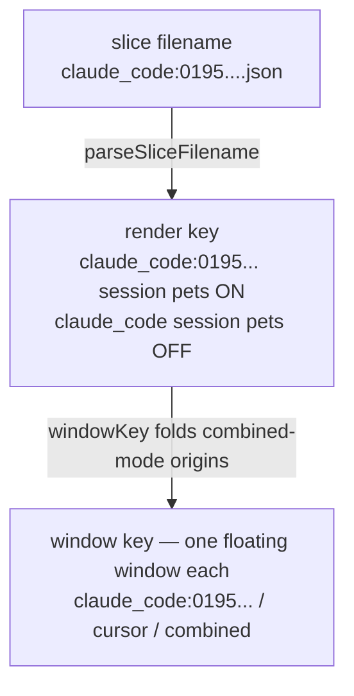
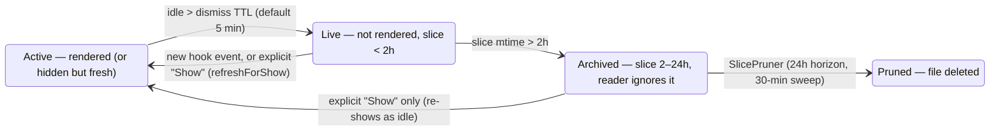

> Goal: hold the *shipped* v2 architecture in your head — every layer between a
> hook firing and N pets on screen — so that Chapter 10's critique (and the v3
> redesign it motivates) reads as obvious rather than opinionated. Each
> section ends with a 🗣️ **plain-English** recap — read those alone for the
> no-jargon version of how v2 works.

Chapter 06 was written *before* v2 landed and describes the plan. This chapter
describes what actually shipped. Read 01–04 first; this builds directly on the
producer/consumer split and the polling loop.

---

## What changed since Chapter 02: the file became a directory

v1's contract was one file, one scalar aggregate. v2's contract is a
**directory of slices**:

```text
~/.codogotchi/state.d/
├── claude_code:0195f3a2-….json   # one slice per (origin, session)
├── claude_code:0195f4c1-….json   # a second concurrent Claude Code session
├── cursor:0195f501-….json
├── codex:0195f3ee-….gate.json    # SOA ticket/gate sidecar (separate polling)
└── …
```

Each slice is still the schema-6 shape you know from Chapter 02
(`activity_state`, `updated_at`, `source_event.origin`, optional `attention`) —
the multiplexing moved **out of the JSON and into the filename**. The filename
is authoritative: `origin:session_id.json`, parsed by
[`StateJsonReader.parseSliceFilename`](https://github.com/cesarnml/codogotchi/blob/main/apps/menubar/Sources/StateJsonReader.swift)
(a plain `origin.json` parses as session `"default"`).

🇹🇸 **TS analogy.** v1 was a single mutable variable that concurrent writers
clobbered (last-writer-wins). v2 is a `Map<`origin:session`, Slice>` implemented
as a directory — each producer owns its own key, so writers never contend.

🗣️ **In plain English.** In v1, every AI tool scribbled its status onto the
same single sticky note, so they kept overwriting each other. In v2, each tool
*session* gets its own sticky note in a shared folder, named after who wrote
it. Nobody overwrites anybody; the app just reads the whole folder.

(The complete file-by-file catalog — writers, readers, clocks, delete-safety
— lives in [Chapter 17](/17-disk-contract/); this chapter narrates, that page
owns the tables.)

Two readers consume the directory, both applying a **2-hour mtime staleness
filter** (a slice untouched for 2h is invisible, as if deleted):

- `readPerPlatformDirectory` — folds slices to **one winner per origin**
  (freshest `updated_at`). Used when a platform renders as a single pet.
- `readPerSessionDirectory` — full `(origin, session)` granularity. Used when
  the user enables **session pets** for a platform.

---

## The key ladder

Everything downstream of the reader is keyed by strings, and there are *three
distinct key vocabularies*. Internalize this ladder — half of v2 debugging is
asking "which kind of key am I holding?":



1. **Slice key** — what's on disk. Always `origin:session_id`.
2. **Render key** — what the polling driver hands the pool after consulting
   `customization.json`: session-keyed if that origin has session pets on,
   plain origin otherwise
   ([`RenderKeyResolver`](https://github.com/cesarnml/codogotchi/blob/main/apps/menubar/Sources/RenderKeyResolver.swift)).
3. **Window key** — the pool's unit of "one floating window". Same as the
   render key, except every combined-mode origin folds into the **literal
   string `"combined"`**.

The discriminators are string operations: colon-split for session identity,
`== "combined"` for the shared window. There is no enum. Remember that for
Chapter 10.

🗣️ **In plain English.** The same pet can be addressed three ways: "this exact
work session," "this tool as a whole," or "everyone sharing the one group
window." The app tells these apart by inspecting the spelling of a text label
— which works, but means every part of the app has to know the spelling rules.

---

## `customization.json` — the user-facing control plane

Everything the pool decides per tick is parameterized by one JSON file, read
fresh every tick via
[`CustomizationJsonReader`](https://github.com/cesarnml/codogotchi/blob/main/apps/menubar/Sources/CustomizationJsonReader.swift):

| Key | Drives |
| --- | --- |
| `platform_modes` | Per origin: `own` (default, dedicated window) · `combined` (fold into the shared window) · `minimalist` (compact badge strip) · `off` (no window) |
| `session_pets_enabled` / `session_cap` | Per origin: session-keyed panels on/off, and how many may render at once (default 3, `0` = unlimited) |
| `evict_session_pets_enabled` | Whether a newcomer session may evict a lower-ranked incumbent when the cap is full |
| `idle_dismiss_ttl_seconds` | How long an idle pet stays on screen (default 300s, `0` = never) |
| `idle_impatient_seconds` / `idle_frustrated_seconds` | Badge escalation while idle |
| `combined_minimalist_enabled` | Renders the combined window as a strip instead of a sprite |
| `minimalist_badge_scale` | Global size of the Minimalist chip/badge row |

Writes go through `CustomizationTabViewModel` (read-merge-write via
`ConfigFileWriter.merge`, so unmanaged keys survive). Since v3-preview, writers
*outside* the Settings tab (right-click mode switches, the Panel Size pill)
post `.customizationDidChangeExternally` so an open Customization tab reloads
instead of going stale. The pool needs no notification — it re-reads the file
next tick anyway.

🗣️ **In plain English.** One settings file is the single source of truth for
"how do you want your pets displayed?" — window style per tool, how many
session pets may show, how long an idle pet lingers. The app re-reads it every
second, so a change made anywhere takes effect almost immediately without
anything needing to tell anything else.

---

## The pool: `FloatingPetWindowPool.update()`

The heart of v2 is one method:
[`FloatingPetWindowPool.update(snapshot:)`](https://github.com/cesarnml/codogotchi/blob/main/apps/menubar/Sources/FloatingPetWindowPool.swift),
called once per poll tick with the reader's snapshot. It is an imperative,
numbered pipeline (Steps 3–8 with lettered sub-steps). Roughly:

1. Re-read customization; note mode changes.
2. Update per-key clocks (see TTL below).
3. Filter to eligible keys; elect the **last-active** key (the one pet immune
   to TTL dismissal, so your desktop is never petless).
4. Force-dismiss windows whose origin switched to `off`.
5. Dismiss TTL-expired windows; suppress re-spawn of expired keys.
6. Collapse windows whose origin folded into `combined` (or whose session-pets
   setting flipped), tearing down stale window shapes (own↔minimalist swaps,
   combined-minimalist flips).
7. Apply the **session cap**: rank sessions, admit up to N, optionally evict
   incumbents; assign session *numbers* from a free-list allocator so "Session
   2" stays stable across ticks.
8. Spawn/refresh windows via the injected factories; push per-tick state into
   each (`apply(state:)`, attention, gate badges, RPG state, labels, scale).

Two subtleties that bite everyone:

**The TTL clock is idle-frozen.** `lastSeenAt[key]` advances every tick while
the slice is non-idle, and *freezes at the moment it goes idle* — so
"TTL expired" literally means "has been continuously idle longer than
`idle_dismiss_ttl_seconds`". A working pet never ages.

**Hidden ≠ dismissed.** The user can hide a window (menubar item or
right-click). Hidden keys leave the `windows` dictionary but persist in
`userHiddenWindowKeys` (written through to `app-state.json` on every toggle,
because crash-exit is a normal way this app dies). A hidden session keeps its
cap slot and session number; "Show" re-spawns it next tick — and since
v3-preview also rewrites the slice's `updated_at`
(`StateJsonWriter.refreshForShow`) so a pet that TTL-expired *while hidden*
actually reappears.

**Session admission has a grandfather gate.** Toggling session pets on
records an activation timestamp and grandfathers the currently-displayed
session as "Session 1"; other sessions must show activity *after* the toggle
to earn a panel. This prevents a wall of zombie panels the instant you enable
the feature on a `state.d/` with weeks of history.

🗣️ **In plain English.** Once a second, one routine decides the fate of every
pet: who appears, who's overstayed their welcome, who gets folded into the
group window, and who's waitlisted because you capped how many may show. Two
house rules explain most surprises: a *busy* pet never ages (only continuous
idleness counts against the timer), and *hiding* a pet is not the same as it
expiring — hidden pets keep their seat and come back when asked.

---

## Three window shapes, one protocol

The pool talks to windows through `FloatingPetWindowControlling`; there are two
factories and three effective shapes:

| Shape | Controller / renderer | Chrome it owns |
| --- | --- | --- |
| **Own pet** | `FloatingPetController` → `FloatingPetPanelController` (SpriteKit sprite in an `NSPanel`) | Animation badge (platform chip + activity pill + session label), attention bubble, SOA gate/ticket badge, conflict bubble, RPG HUD + tombstone/regen, right-click prompt |
| **Minimalist strip** | `MinimalistWindowController` → `MinimalistPanelController` (content-tight badge strip, no sprite, no HUD) | Same badges/bubbles as separate panels, right-click prompt, Panel Size pill |
| **Combined** | Whichever of the above `combined_minimalist_enabled` selects, keyed `"combined"` | Same as its renderer |

Every piece of chrome is **its own floating `NSPanel`**, re-anchored to the pet
panel on drags and poll ticks (Chapter 15 explains why). Right-click anywhere
on a window's chrome routes into one shared prompt
(`FloatingPetHidePrompt` pills: Force Idle / Rename / Prune / mode switch /
Panel Size / Hide), coordinated across windows by
`FloatingPetPromptCoordinator` so only one prompt is ever open.

🇹🇸 **TS analogy.** The pool is a reconciler: `update()` is `render()` diffing
desired children against `windows` (the previous vnode tree), with the
factories as `createElement`. Except — and this matters for Chapter 10 — the
"diff" is hand-written imperative steps, not a derived pure value.

🗣️ **In plain English.** A pet on your screen isn't one window — it's a small
flock of them: the sprite, its name tag, its speech bubble, its status badge,
all separate panels flying in formation, re-aligned many times a second. There
are three body plans (full sprite, compact strip, shared group window), and
each currently sews its own flock together by hand.

---

## The session lifecycle: four tiers, three clocks

v2 quietly created a lifecycle with **three independent clocks**, and no single
type in the codebase names it. Reconstructed:



| Clock | Where | Default |
| --- | --- | --- |
| Dismiss TTL (idle-frozen) | pool `update()` | 300s, user-configurable, `0` = never |
| Reader staleness | `StateJsonReader` mtime filter | 2h, hard-coded |
| Prune horizon | [`SlicePruner`](https://github.com/cesarnml/codogotchi/blob/main/apps/menubar/Sources/SlicePruner.swift) | 24h, 30-min timer |

(These clocks and the full `customization.json` key reference are maintained
in [Chapter 17](/17-disk-contract/) — treat that page as canonical if the two
ever disagree.)

The v3 **Sessions panel** is essentially this diagram as UI (Active / Live /
Archived tabs). How that diagram became a real type — and how the pool was
rewritten underneath it — is [Chapter 13](/13-v3-as-built/). The roadmap note
that scoped the work still lives in the main repo:
`notes/private/codogotchi-v3-polish-roadmap.md`.

🗣️ **In plain English.** A pet passes through four ages: on screen → recently
active but tucked away → dormant (invisible, still recoverable) → gone for
good. Three different timers drive those transitions, they don't know about
each other, and today the user can't see any of it — which is exactly why v3
adds a Sessions panel that lays the ages out in the open. (Shipped — see
Chapter 13.)

---

## Prove it to yourself

1. Run two concurrent Claude Code sessions with session pets on, then
   `ls ~/.codogotchi/state.d/` — match each filename to a panel's session
   badge. Rename one panel and find the label in `session-labels.json`.
2. Set the dismiss TTL to 1 minute, let a pet idle out, then use the menubar
   "Show" item. Watch the slice's `updated_at` change on disk
   (`fswatch ~/.codogotchi/state.d` or just `cat` before/after).
3. In `FloatingPetWindowPool.swift`, find the exact line where `"combined"`
   the *string* is compared. Count how many files perform that comparison.
   Keep the number in mind for Chapter 10.
