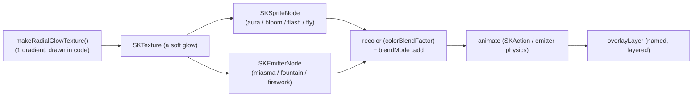

> Goal: deeply understand the SpriteKit effect layer that makes the pet feel
> *alive* — sickness haze + flies, level-up fireworks + bloom — **without a single
> new art asset**. This is the mechanic you'll lean on to add life cheaply, so
> this chapter teaches the *toolkit generatively*: not just "here's what the two
> effects do," but "here's the kit, here's how to invent new life with it."
>
> Prereq: [Ch.10](./10-macos-primitives-primer.md)'s SpriteKit section
> (`SKView`/`SKScene`/`SKSpriteNode`/`SKTexture`/`SKAction`). All effect code lives
> in [`FloatingPetScene.swift`](https://github.com/cesarnml/codogotchi/blob/main/apps/menubar/Sources/FloatingPetScene.swift),
> lines ~646–1005.

---

## The thesis (read this twice)

> **Every effect in the app is built from ONE procedurally-drawn texture — a soft
> radial glow — recolored, scaled, blended additively, animated with `SKAction`,
> and/or sprayed through a particle emitter.** No spritesheet rows. No artist.

That single texture is `makeRadialGlowTexture` (a gradient drawn in code). The
green sickness aura, the flies, the gold sparks, the firework flashes, the
level-up bloom — **all the same glow dot**, tinted and moved differently. Once you
see that, "adding new life" stops being an art problem and becomes a *composition*
problem you can solve in Swift alone.



---

## The five building blocks

Everything below is assembled from these. Learn the five and you can read — and
write — any effect.

### 1. The texture factory — drawing art in code
[`FloatingPetScene.swift:964`](https://github.com/cesarnml/codogotchi/blob/main/apps/menubar/Sources/FloatingPetScene.swift#L964):

```swift
private static func makeRadialGlowTexture(color: NSColor, diameter: Int = 128) -> SKTexture {
    let image = renderImage(width: diameter, height: diameter) { ctx in
        let rgb = color.usingColorSpace(.deviceRGB) ?? color
        let colors = [rgb.withAlphaComponent(1.0).cgColor,
                      rgb.withAlphaComponent(0.0).cgColor] as CFArray
        let grad = CGGradient(colorsSpace: cs, colors: colors, locations: [0, 1])!
        let c = CGPoint(x: diameter/2, y: diameter/2)
        ctx.drawRadialGradient(grad, startCenter: c, startRadius: 0,
                               endCenter: c, endRadius: CGFloat(diameter)/2, options: [])
    }
    return image.map(SKTexture.init(cgImage:)) ?? SKTexture()
}
```

🧠 **Plain English.** Make a 128×128 bitmap, paint a radial gradient from
*opaque-center* to *transparent-edge*, hand it to SpriteKit as a texture. That's a
soft glowing dot. `renderImage` ([:985](https://github.com/cesarnml/codogotchi/blob/main/apps/menubar/Sources/FloatingPetScene.swift#L985))
is the generic "give me a `CGContext`, I'll hand back a `CGImage`" helper —
**this is your door to drawing *any* shape in code** (rings, stars, Zzz, hearts):
swap the `drawRadialGradient` body for other Core Graphics calls (`addArc`,
`addLines`, `fill`, `stroke`).

🇹🇸 **TS analogy.** `renderImage` is an offscreen `<canvas>` + 2D context; you
draw into it and `toDataURL` → a texture. `makeRadialGlowTexture` is one such draw
routine (a `createRadialGradient`).

⚠️ **Premultiplied alpha + additive blending.** The bitmap is
`premultipliedLast` so that when drawn with `.add` blend mode the transparent
edges don't add gray fringes — they read as clean light. This pairing (soft alpha
glow + `.add`) is *why* the effects look like light rather than stickers.

### 2. The two node types — sprite vs emitter
- **`SKSpriteNode(texture:)`** — *one* instance of the texture you place and
  animate. Used for the sickness **aura**, the level-up **bloom**, each firework
  **flash**, and the **flies**. Think: a single positioned image.
- **`SKEmitterNode`** — a *particle system*: spawns many short-lived copies of a
  `particleTexture` according to physics knobs. Used for the sickness **miasma**,
  the spark **fountain**, and the radial **firework burst**. Think: a fountain/
  fog machine that throws the glow dot around.

🧠 One sprite = a deliberate placed glow. One emitter = a swarm of glows with
emergent motion. You'll reach for a sprite for "a thing," an emitter for "a
spray/cloud/burst."

### 3. Blend + recolor — one gray glow becomes any colored light
- **`blendMode = .add`** (additive): pixels *add* to what's behind → overlapping
  glows brighten → reads as emitted light. Almost every effect node uses it.
- **`color` + `colorBlendFactor = 1.0`** (sprites) / **`particleColor` +
  `particleColorBlendFactor = 1.0`** (emitters): tint the texture. The *same* glow
  texture becomes sick-green, gold, or fly-dark purely by recolor.

🧠 This is the core economy: you don't make a green texture and a gold texture —
you make **one** glow and recolor it at use-site. New color = new feeling, zero
new assets. The palette constants live at
[:657–676](https://github.com/cesarnml/codogotchi/blob/main/apps/menubar/Sources/FloatingPetScene.swift#L657)
(`levelUpGold`, `sicknessWarningGlow`, `sicknessCriticalGlow`, `sicknessFlyTint`).

### 4. SKAction — the animation verbs
SpriteKit animations are declarative `SKAction`s, composed. The vocabulary used
here (this is most of what you'll ever need):

| Action | Does | Seen in |
|---|---|---|
| `.fadeAlpha(to:duration:)` / `.fadeOut` | animate opacity | aura pulse, bloom, flash |
| `.scale(to:duration:)` / `.setScale` | animate size | bloom grow, flash pop |
| `.group([...])` | run children **in parallel** | fade+scale together |
| `.sequence([...])` | run children **one after another** | pop → hold → fade |
| `.repeatForever(...)` | loop | sickness aura pulse, fly orbit |
| `.wait(forDuration:)` | delay | stagger fireworks, gate emitters |
| `.run { ... }` | run a closure | flip `particleBirthRate` on/off |
| `.removeFromParent()` | delete the node | transient cleanup |
| `.follow(path:asOffset:orientToPath:duration:)` | move along a `CGPath` | the flies' looping orbit |

🇹🇸 **TS analogy.** `.group` ≈ `Promise.all`, `.sequence` ≈ `await` in order,
`.repeatForever` ≈ an infinite loop, `.run {}` ≈ a callback step. It's a tiny
animation DSL — keyframes as data.

### 5. The layer + lifecycle convention
The scene has two child nodes ([:95](https://github.com/cesarnml/codogotchi/blob/main/apps/menubar/Sources/FloatingPetScene.swift#L95)):
`petLayer` (the sprite) and **`overlayLayer`** (all effects), both centered on the
panel. Effects are children of `overlayLayer`, each given a **name** so it can be
found and removed:

- **Persistent effects** (sickness): added under name `"sicknessEffect"`; the next
  `refreshSicknessEffect()` removes the old one first and re-adds if still sick.
  Lives until healthy or ghost.
- **Transient effects** (level-up): added under `"levelUpEffect"`; self-removes via
  `.sequence([.wait(2.0), .removeFromParent()])`. Calling again replaces an
  in-flight one.

🧠 The pattern to copy for any new effect: *build a named container `SKNode`, add
your sprites/emitters to it, add it to `overlayLayer`, and either remove-and-
replace (persistent) or self-remove after a delay (transient).*

---

## The SKEmitterNode knob cheat-sheet

Emitters have a big parameter surface; here's what each knob means, with the three
real configs decoded. (All on `SKEmitterNode`.)

| Knob | Meaning |
|---|---|
| `particleTexture` | the per-particle image (our glow dot) |
| `particleBirthRate` | particles spawned per second (set `0` to pause; flip via `.run`) |
| `numParticlesToEmit` | total then stop (`0` = infinite) — fireworks use a fixed count |
| `particleLifetime` (+`Range`) | seconds each particle lives |
| `emissionAngle` (+`Range`) | direction (radians) particles launch; `Range` = spread |
| `particleSpeed` (+`Range`) | launch speed |
| `yAcceleration` / `xAcceleration` | gravity-like pull (negative y = slow a rising spray) |
| `particlePositionRange` | spawn area (a `CGVector` box) |
| `particleAlpha` (+`Speed`) | start opacity, and how it changes over life (`-` fades out) |
| `particleScale` (+`Range`,`Speed`) | size and growth/shrink over life |
| `particleColor` + `particleColorBlendFactor` | tint |
| `particleBlendMode` | usually `.add` for light |

**Decoded — sickness miasma** ([:739](https://github.com/cesarnml/codogotchi/blob/main/apps/menubar/Sources/FloatingPetScene.swift#L739)):
slow upward fog. Low birth rate, emission straight up (`π/2`) with a wide spread,
gentle `yAcceleration`, low alpha that fades, green tint, `.add`. → reads as a
sickly rising haze. Critical doubles birth rate/speed/alpha.

**Decoded — level-up fountain** ([:870](https://github.com/cesarnml/codogotchi/blob/main/apps/menubar/Sources/FloatingPetScene.swift#L870)):
a quick upward gush. High birth rate (220) for 0.55 s then `birthRate = 0`,
straight up, *negative* `yAcceleration` so sparks slow as they rise, fast alpha
fade, gold. → a celebratory spark fountain at her feet.

**Decoded — firework burst** ([:935](https://github.com/cesarnml/codogotchi/blob/main/apps/menubar/Sources/FloatingPetScene.swift#L935)):
a radial pop. `numParticlesToEmit = 34`, full-circle emission
(`emissionAngleRange = 2π`), speed tuned to `radius` so the reach stays inside the
panel, birthRate gated on after a `delay` via `.run`. → a round firework that
doesn't punch through the edges.

🧠 Same node type, three totally different feels — purely from the knobs. This
table *is* your effect-design palette.

---

## Two production effects, annotated

### Sickness (persistent, health-driven)
Trigger: `applyRPGState` computes `SicknessLevel(halfHearts:)` and calls
`setSicknessLevel` → `refreshSicknessEffect()`
([`FloatingPetPanel.swift:237`](https://github.com/cesarnml/codogotchi/blob/main/apps/menubar/Sources/FloatingPetPanel.swift#L237)).
Composition ([:678](https://github.com/cesarnml/codogotchi/blob/main/apps/menubar/Sources/FloatingPetScene.swift#L678)):
1. **Aura** — one recolored glow sprite behind her, `.add`, pulsing forever
   (`repeatForever` of a fade+scale `group`). Bigger/brighter when critical.
2. **Miasma** — an emitter of green haze rising off her.
3. **Flies** — 2 (warning) or 4 (critical) glow sprites tinted dark, each
   `.follow`-ing a hand-built elliptical `CGPath` orbit, staggered by index.

Intensity scales by `sicknessLevel` (alpha, counts, speeds) — *one* composition,
two dial settings.

### Level-up (transient, event-driven)
Trigger: when the HUD view-model detects a level increase it emits a `.levelUp`
flash; the panel calls `scene.playLevelUpEffect()`
([`FloatingPetPanel.swift:232`](https://github.com/cesarnml/codogotchi/blob/main/apps/menubar/Sources/FloatingPetPanel.swift#L232)).
Composition ([:814](https://github.com/cesarnml/codogotchi/blob/main/apps/menubar/Sources/FloatingPetScene.swift#L814)):
1. **Bloom** — a big glow at her feet that flashes in, holds, fades while scaling
   up (a `sequence` of `group`s).
2. **Fountain** — the upward spark gush (emitter, gated off after 0.55 s).
3. **Two fireworks** — `spawnFirework` at hip-left and shoulder-right, the second
   delayed 0.18 s, each a flash sprite + a radial burst emitter, edge-clamped.
4. The whole container self-removes after 2 s.

🧠 Note the *staging*: bloom (anticipation) → fountain (rise) → staggered side
bursts (payoff). That choreography — not fancier art — is what makes it read as a
"WoW-style" celebration. Liveliness is **timing and composition**, not pixels.

---

## Why this is the "alive without new sprites" mechanic

A new spritesheet animation costs an artist, a tier sheet, a row-map entry, and a
schema/contract dance. A new **procedural effect** costs *a function in
`FloatingPetScene`*. It:
- reuses one (or a few) code-drawn textures, recolored per use,
- composes the same node + action + emitter vocabulary,
- anchors to the pet's real opaque bounds (`currentSpriteOpaqueRect`,
  [:699](https://github.com/cesarnml/codogotchi/blob/main/apps/menubar/Sources/FloatingPetScene.swift#L699)) so it sits on her
  body at any size/position, with a fallback rect,
- is cheap (textures cached on first use; transient effects self-remove; the whole
  float already opts out of App Nap only while visible — Ch.10).

So the roadmap implication: **emotional range (happy, sleepy, focused, hyped,
nervous, celebrating) can grow largely in code.** New sprite sheets become a
*polish* lever, not a *requirement*, for making her feel alive.

---

## Recipes — what's possible (design palette)

Concrete starting points. Each is "desired feeling → which blocks + knobs." None
needs new art.

| Want | Build it from |
|---|---|
| **Sleepy (Zzz)** | 2–3 glow sprites tinted pale blue, each running `sequence([fadeIn, moveBy up-right, fadeOut])` on `repeatForever`, staggered. Or draw a "Z" glyph in `renderImage` (Core Graphics text) and reuse. Trigger on long idle / escalation. |
| **Happy / petted** | a short emitter burst of small recolored glows (pink/white) popping upward, like a mini-fountain with low count + `numParticlesToEmit`. Transient, self-remove ~1 s. Trigger on click/pet. |
| **Focused / in-flight** | a steady soft aura sprite (like sickness aura but calm blue, slow pulse) while `state.isInFlight` (Ch.02). Persistent; remove when not in-flight. |
| **Thinking** | one glow orbiting a small `CGPath` above her head (reuse the fly `.follow` pattern, recolored, single, slow). |
| **Hyped / streak** | crank the level-up fountain's birthRate + add a second color; or a brief screen-edge sparkle ring (emitter with full-circle emission at the panel border). |
| **Weather / ambiance** | a top-anchored emitter raining tiny glows downward (`emissionAngle = -π/2`, positive `yAcceleration`). |
| **New shape** (ring, star, heart) | replace `drawRadialGradient` in a new `renderImage` routine with `addArc` / `addLines` / `fill`; everything else (recolor, blend, animate, emit) is unchanged. |

🧠 The meta-recipe: **(1)** decide a *texture* (reuse the glow, or draw a new shape
in `renderImage`); **(2)** pick *sprite* (a placed thing) or *emitter* (a spray);
**(3)** *recolor* + `.add`; **(4)** *animate* with `SKAction` or emitter physics;
**(5)** add to `overlayLayer` under a *name*, persistent or self-removing;
**(6)** anchor to `currentSpriteOpaqueRect`; **(7)** pick a *trigger* (state,
RPG event, interaction, idle).

---

## 🧪 Prove it to yourself

1. **Find the one texture.** Confirm that sickness aura, flies, miasma, level-up
   bloom, fountain, and fireworks *all* ultimately draw `makeRadialGlowTexture`'s
   output — just recolored/scaled. (Search every `…GlowTexture`/`sparkTex`/`flyTex`
   assignment.) Internalize: it's all one dot.

2. **Recolor live.** Temporarily change `sicknessWarningGlow` to bright magenta
   ([:659](https://github.com/cesarnml/codogotchi/blob/main/apps/menubar/Sources/FloatingPetScene.swift#L659)), rebuild, and
   use `tcs`/the heart helpers to get her "warning" sick. The haze is now magenta —
   proof the color is a use-site decision, not baked into art. Revert.

3. **Read the choreography.** In `playLevelUpEffect`, list the timeline in
   milliseconds: when does the bloom peak, the fountain stop, each firework fire?
   Notice how the *stagger* creates the "celebration" feel.

### Capstone exercise — add a new procedural effect *(mini-challenge)*
Add a **"happy sparkle"** that plays when you pet her (click-hold without drag, or
on de-escalation). Reuse the glow texture; emit ~12 small recolored (pink/white)
glows popping upward; transient, self-removing in ~1 s; anchored to her opaque
rect.

- **Where:** a new `playHappyEffect()` on `FloatingPetScene`, modeled on
  `playLevelUpEffect` (steal the fountain emitter, shrink it). Trigger it from the
  panel where the relevant gesture is handled (look near the interaction / click
  handling in `FloatingPetPanel.swift`).
- **Success:** petting her produces a brief upward sparkle that clears itself; no
  new asset; nothing left in `overlayLayer` after ~1 s (verify by name lookup).
- **Hint shape (don't over-build):** copy the fountain block, set a low
  `numParticlesToEmit`, recolor, wrap the container in `sequence([wait, removeFromParent])`.

This is the rep that turns "I understand the effects" into "I can give her new
life on demand." When you're ready, we can promote this into a full tiered
challenge in [Ch.07](./07-challenges.md).

➡️ Back to the [README / index](./README.md).
