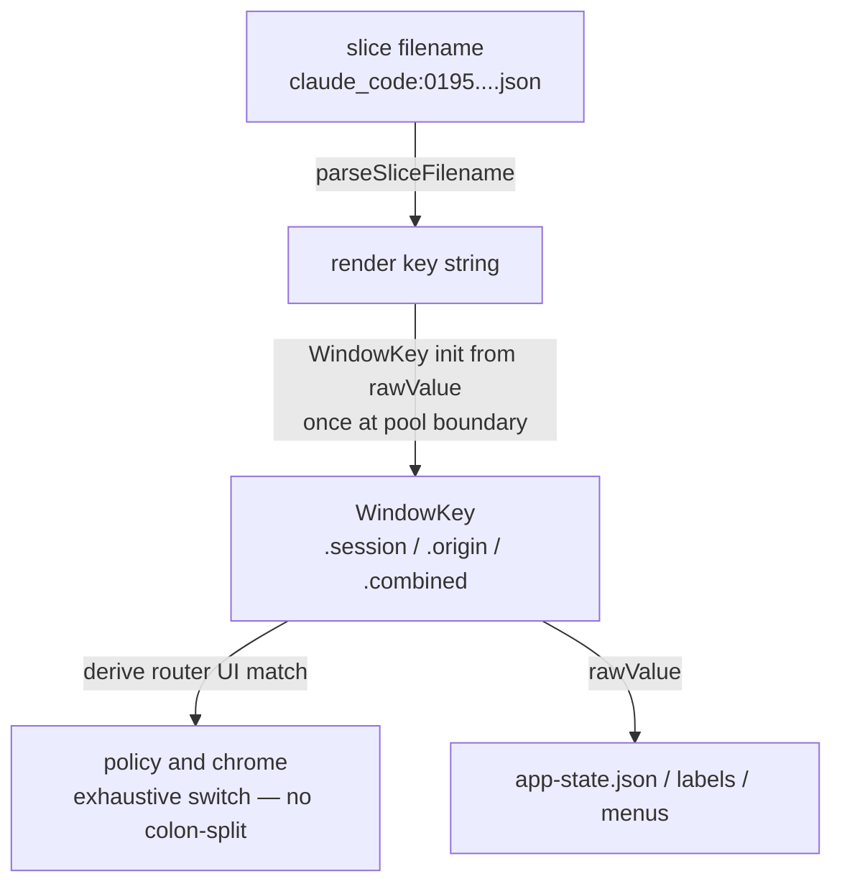

> Goal: hold the *shipped* v3 consolidation architecture in your head — the
> same spine Chapter 09 narrated for v2, but after phases 16–20 closed Track 4
> and threaded fold identity + sticky slice clocks. Read Chapter 09 for what
> the product still *does*; read Chapter 10 for why it ached; this chapter is
> what landed. Each section ends with a 🗣️ **plain-English** recap.

Chapter 09 described the v2 window pool as stringly-typed, imperative, and
flat. Chapter 10 named six seams and a case study. Phases **16 → 18** paid
those seams down as a serial Track 4 program (behavior freeze, dogfood DMGs,
no public release). Phases **19 → 20** then shipped the first product work
that *required* that foundation — fold-window session identity and sticky
on-disk timestamps — plus a handful of follow-up fixes on `v3_preview`.
Public notarization / Sparkle (Track 2) is still ahead.

---

## The program in five breaths

| Phase | Codename | What shipped |
| --- | --- | --- |
| **16** | Types and drawers | Layer dirs under `Sources/`; god-file splits; `WindowKey`, `SessionLifecycle`, `CustomizationStore` |
| **17** | Surface convergence | Shared prompt/dismissal, `ChromeFlockCoordinator`, one renderer shape + `WindowActionRouter` |
| **18** | Pool pipeline split | Pure `derive` → mechanical `diff` → effect-only `apply`; old imperative pipeline deleted |
| **19** | Fold-window identity | Every rendered window carries the real winning `state.d` session; Prune/labels/mode chip follow it |
| **20** | Sticky slice timestamps | `prompt_started_at` / `session_started_at` / `errored_since` / `turn_ended_at` on slices; PromptTimer + Sessions "Started" |

Speak the map: **16 gives vocabulary and filing, 17 makes three skins share machinery, 18 makes pool policy pure, 19 stops discarding the winner behind a fold, 20 stops trusting in-memory clocks.**

🗣️ **In plain English.** v3 didn't rewrite the pet app. It sorted the filing
cabinet, gave the three kinds of window real names, built the right-click
menu once, taught the once-a-second routine to *decide* before it *does*, then
finally taught folded windows and timers to remember who and when.

---

## What changed since Chapter 09: drawers instead of a heap

```text
apps/menubar/Sources/
├── App/          # entry, menu, polling driver, demo
├── State/        # disk contract — readers, writers, pruners, CustomizationStore
├── Pool/         # WindowKey, SessionLifecycle, derive/diff/apply, router
│   └── Derive/
├── Windows/      # panels, chrome, prompts, ChromeFlockCoordinator
├── Scene/        # SpriteKit + pet loaders
└── Settings/     # tabs + view models (incl. Sessions)
```

Zero Swift files at `Sources/` root. Chapter 10's Seam 6 ("one drawer") is
closed mechanically: xcodegen still globs; navigation matches the layers this
guide already taught. God-files are gone — `FloatingPetPanel.swift` and the
monolithic Settings controller were split type-per-file in Phase 16.

🗣️ **In plain English.** The menubar sources used to be ~60 files in one
folder with two multi-thousand-line monsters. Now they're ~135 files in six
labeled drawers. Same app; you can find things by *what layer they are*.

---

## Seam ledger: Chapter 10 → as built

| Ch.10 seam | v3 shape that landed | Where to look |
| --- | --- | --- |
| **1 — Stringly-typed window keys** | `WindowKey` enum (`.origin` / `.session` / `.combined`), parsed once at the pool boundary; `rawValue` is serialization only | [`WindowKey.swift`](https://github.com/cesarnml/codogotchi/blob/main/apps/menubar/Sources/Pool/WindowKey.swift) |
| **2 — Factory god-closures** | `WindowActionRouter` owns targeting; factories wire `panel.onX = { router.handle(…) }` | [`WindowActionRouter.swift`](https://github.com/cesarnml/codogotchi/blob/main/apps/menubar/Sources/Pool/WindowActionRouter.swift) |
| **3 — Three-surface parity by hand** | One prompt builder + dismissal stack; `ChromeFlockCoordinator` for chrome formation; capability matrix documents intentional skin differences | [`FloatingPetPromptBuilder.swift`](https://github.com/cesarnml/codogotchi/blob/main/apps/menubar/Sources/Windows/FloatingPetPromptBuilder.swift), [`ChromeFlockCoordinator.swift`](https://github.com/cesarnml/codogotchi/blob/main/apps/menubar/Sources/Windows/ChromeFlockCoordinator.swift), `docs/contracts/window-capability-matrix.md` |
| **4 — `update()` mixes policy + effects** | `PoolDerive.derive` → `PoolDiff` → `PoolApply`; no AppKit in derive; legacy pipeline deleted after shadow cutover | `Pool/Derive/`, [`PoolApply.swift`](https://github.com/cesarnml/codogotchi/blob/main/apps/menubar/Sources/Pool/PoolApply.swift) |
| **5 — Config writers multiplying** | Single `CustomizationStore` (read-merge-write + change publication); Settings VM is an adapter | [`CustomizationStore.swift`](https://github.com/cesarnml/codogotchi/blob/main/apps/menubar/Sources/State/CustomizationStore.swift) |
| **6 — Flat `Sources/`** | The six drawers above | — |
| **Case study — implicit lifecycle** | `SessionLifecycle` classifier + Settings > Sessions consuming it; fold identity + sticky stamps close the "Show Pet did nothing"/timer-lie classes | [`SessionLifecycle.swift`](https://github.com/cesarnml/codogotchi/blob/main/apps/menubar/Sources/Pool/SessionLifecycle.swift) |

Not every Track 1 UX gap or Track 2 distribution item is done — only the
**consolidation** seams Chapter 10 argued for. Distribution (notarize →
Sparkle → cask → App Store investigation) remains the v3 public-ship work;
see [Chapter 18](/18-app-store-requirements/).

🗣️ **In plain English.** Chapter 10's wish list mostly shipped. Pets still
look and behave like Chapter 09; the difference is that the compiler, one
settings gatekeeper, and a pure "who should be on screen" function now own
decisions that used to live as string checks and copy-pasted callbacks.

---

## The key ladder, typed

Chapter 09's three vocabularies still exist. What changed is the middle of
the ladder is no longer "inspect the spelling":



1. **Slice key** — still `origin:session_id` on disk ([Chapter 17](/17-disk-contract/)).
2. **Render key** — still what [`RenderKeyResolver`](https://github.com/cesarnml/codogotchi/blob/main/apps/menubar/Sources/Pool/RenderKeyResolver.swift) hands the pool after consulting customization.
3. **Window key** — now a `WindowKey` value. String form survives only for
   persistence and fixtures. Policy sites `switch` the enum.

`rawValue` is deliberately **not injective** (`.origin("combined")` and
`.combined` both serialize to `"combined"`) — that mirrors the pre-enum
contract. Construct cases directly when a reserved name is possible; don't
re-invent colon-splits at call sites.

🗣️ **In plain English.** The three addresses for a pet still exist, but the
app now translates the text label into a named kind *once*, then talks in
named kinds until it has to save something to disk again.

---

## `SessionLifecycle` — the four ages as a type

Chapter 09's Active / Live / Archived / Pruned diagram used to exist only in
this guide and in comments. Phase 16 made it a classifier:

```swift
SessionLifecycle.classify(
  age:…, isRendered:…, isConcealed:…,
  liveTTL: /* reader 2h */, archiveTTL: /* prune 24h */
)
```

Precedence is fixed (prune horizon wins; rendered ⇒ active; concealed-but-fresh
⇒ active; else live vs archived). Settings > Sessions and the menubar pet
section consume the same type — the case-study bug chain in Chapter 10
("Show Pet" × three clocks × hidden keys) is now a match-statement read plus
named store fields, not a scavenger hunt.

🗣️ **In plain English.** A pet's four ages finally have a name the code
shares with the Sessions panel. "What state is this session in?" is one
function, not three timers you have to reconcile by hand.

---

## The pool: derive → diff → apply

Chapter 09's heart was `FloatingPetWindowPool.update()` as a ~10-step
imperative recipe. Phase 18 replaced that shape:

```text
PoolTickInput + PoolMemory
        │
        ▼
   PoolDerive.derive   // pure — DesiredWindows + next memory
        │
        ▼
   PoolDiff            // spawn / dismiss / update + frame directives
        │
        ▼
   PoolApply           // factories, teardown, per-tick pushes only
```

**Derive** folds TTL/last-active immunity, mode transitions, combined
folding, session caps/eviction, grandfather gating, and hidden keys into a
`DesiredWindows` value keyed by `WindowKey`. No AppKit imports — policy is
table-testable. Recomputing membership from scratch each tick made an entire
"stale window after mode transition" bug class *unrepresentable* (the old
pipeline needed four separate teardown steps to paper over a persistent
`windows` dictionary).

**Diff / apply** stay dumb: desired vs current → effects. Phase 18 migrated
via shadow-compare (old drove, new shadowed → cutover → roles reversed →
legacy deleted). There is one pipeline in the tree today.

🇹🇸 **TS analogy.** Chapter 09 compared the pool to a hand-written reconciler.
v3 is closer to what you wanted then: `derive` is the pure vnode computation;
`diff`/`apply` are commit.

🗣️ **In plain English.** Once a second the app still decides every pet's fate —
but "decide" is now a calculation you can unit-test with plain data, and
"open/close windows" is a separate dumb step. Same pets on screen; far fewer
places for a one-line policy bug to hide.

---

## Fold windows carry a real session (Phase 19)

Phase 18 correctly elected a *winner* slice for `.origin` / `.combined`
windows but discarded that identity before Prune, labels, and some Show
paths could use it. Phase 19 threads the winning `(origin, sessionId)` (or
`"default"`) into each tick's `DesiredWindow`:

- **Prune** on any skin removes the visible session's slice — no silent
  no-op when `WindowKey.sessionIdentity` is nil.
- **Primary labels** live-track the winner's platform-synced / LLM title
  (manual rename remains an override).
- **Mode chip** on fold/combined windows names the fold ("Combined" or the
  platform) so they stay visually distinct from true single-session pets.
- **Follow-ups since closeout** tightened Show for folded pets, combined
  winner mode-changes, Minimalist chip layout, and Prune menu titling (bare
  "Prune Session" stayed; identity still shows on the window itself).

Non-winning siblings under a fold still live in Settings > Sessions — that
surface wasn't enlarged in 19.

🗣️ **In plain English.** When several sessions share one floating pet, the
window finally admits which real conversation it's showing. Prune and rename
hit *that* conversation, and a small badge reminds you the pet is folding
something.

---

## Sticky slice clocks (Phase 20)

Prompt elapsed used to live in memory keyed off advancing `updated_at` — so
hide, TTL dismiss, fold churn, or relaunch could lie or reset the timer.
Phase 20 bumped the slice contract with sticky optional stamps:

| Field | Role |
| --- | --- |
| `prompt_started_at` | when the current prompt/turn began |
| `session_started_at` | when the slice was born |
| `errored_since` | lasting error clock |
| `turn_ended_at` | frozen/ended turn clock |

Hooks set/clear/preserve them on lifecycle edges (not every mid-turn tool
tick). [`PromptTimer`](https://github.com/cesarnml/codogotchi/blob/main/apps/menubar/Sources/Windows/PromptTimer.swift)
hydrates from disk; Settings > Sessions shows relative **Started …** when
`session_started_at` exists. Shipped lockstep with contracts, hook binary,
and five installers — refresh hooks with the app (release notes, no in-app
outdated-hooks banner yet). Full field tables remain in
[Chapter 17](/17-disk-contract/).

🗣️ **In plain English.** Timers and "when did this session start?" now live on
the sticky notes themselves. Hiding a pet, folding winners, or restarting the
app no longer invents a new stopwatch from scratch.

---

## Customization — one writer

Chapter 09 listed `CustomizationTabViewModel` plus throwaway VMs and a
notification shout as the sync story. Phase 16 replaced that with
`CustomizationStore`: one merge-write path, subscribers notified through the
store API. Right-click mode switches and Panel Size ask the store; the pool
still re-reads customization each tick as before.

🗣️ **In plain English.** One gatekeeper owns `customization.json`. Nobody
builds a disposable settings editor just to flip a mode, and nobody has to
yell across the app that the file changed.

---

## What the product looks like on top

Behavior Chapter 09 taught is intact: `state.d/` slices, session pets / caps /
TTL, three window skins, chrome flocks, Sessions Active/Live/Archived. What
v3 as-built *adds* for a daily driver:

- Sessions panel backed by `SessionLifecycle` + Refresh + bulk Prune All
- Fold identity / mode chips / truthful Prune targeting
- Sticky-stamp PromptTimer + Started subtitles
- Shared prompts and chrome coordinator (parity is structural)

Still open for the *public* v3 release: notarized DMG, Sparkle, Homebrew
cask, and the App Store investigation ([Chapter 18](/18-app-store-requirements/),
[Chapter 12](/12-v3-learning-resources/) Tier 1–2).

---

## Prove it to yourself

1. `ls apps/menubar/Sources` — confirm six drawers, no root `.swift`. Then
   `rg -n '"combined"' apps/menubar/Sources` and classify hits: only
   `WindowKey` parse/serialize plus legitimate assignment/attribution domains,
   not pool policy. Compare to Chapter 09 exercise 3 / Chapter 10 exercise 1.
2. Open `Pool/Derive/PoolDerive.swift` and find where desired membership is
   computed. Confirm it imports no AppKit. Sketch one Phase 15–style gap
   (mode transition, hide-while-capped, grandfather, eviction frame inherit)
   as a table-driven input to `derive`.
3. Fold two origins into Combined (or enable session pets then fold). Note the
   mode chip and live primary label; Prune once and confirm the matching
   `state.d/` file is the one that disappeared. Then start a long prompt,
   hide the pet, relaunch — PromptTimer should resume from
   `prompt_started_at`, not invent zero.
