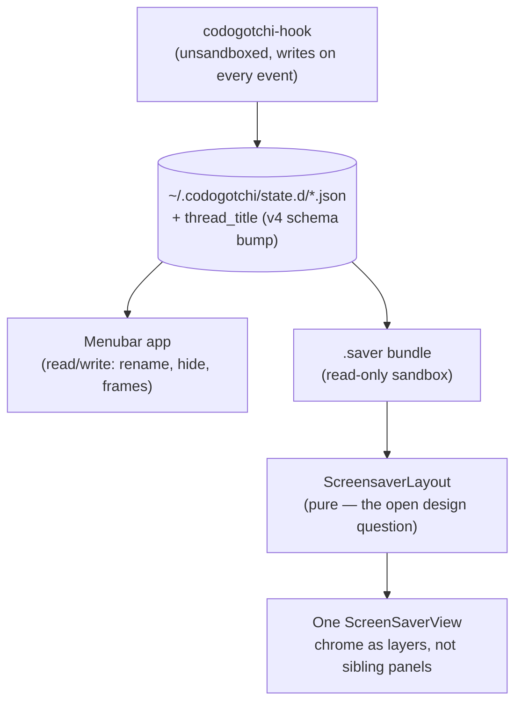

> Goal: connect everything you've read to the committed v4 headline feature —
> Codogotchi as a real macOS screensaver, not a lookalike — and point at the
> exact shape the work takes. After this you should be able to scope the
> work yourself.

> 📜 **Design-time snapshot.** This chapter documents the direction agreed
> during the phase-22 planning discussion, before any code has landed and
> before the formal product plan (`/soa plan`) is finalized. Treat it the way
> Chapter 06 treated v2 before it shipped — the plan and the reasoning behind
> it, not a description of running code. Once phase-22 ships, expect a
> "22 — v4 As Built" chapter, mirroring how Chapter 06 was followed by
> Chapter 09.

---

## The feature in one line

> Today: floating pets live on your desktop while you're at the keyboard, and
> vanish when you're not. v4: Codogotchi appears in **System Settings › Screen
> Saver** as a real, selectable screensaver — your whole pet fleet, fullscreen,
> while you're away.

"Real screensaver" is load-bearing. It means a `.saver` bundle the user picks
from the system picker — governed by the OS's own idle-time slider, correct
at the lock screen, composable with Hot Corners — not an in-app overlay that
merely *watches* for screensaver activation and draws on top of whatever the
user actually chose. That second shape was seriously considered and rejected;
see "The trigger decision" below for the receipts.

---

## The crux: the disk contract already supports this

This is the whole reason v4 is tractable this soon, and it's why Chapters
01–02 spent so long on the disk contract. Recall the one-sentence mental
model from the README:

> **The Swift app is a pure-ish render function over a file on disk.** A
> separate process (the CLI hook) writes state; the app polls and turns
> whatever it reads into pixels. The app almost never writes that file — it
> is downstream of it.

🗣️ **In plain English.** The pet app doesn't own the diary — it just reads
it. A screensaver is *also* just a reader. If the diary is already being
written by something else, a second, completely independent reader can read
it too, without asking the first reader's permission.

Verified directly against the running app this session, not assumed: the
hook (`codogotchi-hook`) writes `state.d/*.json`, `rpg-state.json`, and
`prompt-attention.json` on every relevant Claude Code / Cursor / Codex /
Copilot / Antigravity event, and reads only its own artifacts. It never asks
the menubar app anything. So "can a screensaver work without the app
running" was already **yes** before v4 was scoped — v4 is mostly about
building a second, read-only consumer of a contract the producer side
already satisfies.

---

## The trigger decision

Two shapes were on the table. The receipts, measured directly on a
running macOS 26.5.2 machine rather than assumed from memory:

| `NSWindow.Level` | Value |
|---|---|
| `.floating` (every pet panel today) | 3 |
| `.popUpMenu` | 101 |
| `.screenSaver` | 1000 |
| `CGShieldingWindowLevel()` (the real OS screensaver shield) | 2,147,483,628 |

**Option A — in-app overlay.** Listen for `com.apple.screensaver.didstart`,
draw a window at `CGShieldingWindowLevel()+1`. Reuses the existing floating-
panel rendering stack untouched. But it *stacks on top of* whatever
screensaver the user actually selected — if they run Flurry, they'd get
Flurry **and** Codogotchi layered together — and it must tear itself down
hard at the lock boundary, using an unsanctioned window level one above a
constant Apple documents as the top of the stack. It's an impersonation, not
a screensaver.

**Option B (chosen) — a real `.saver` bundle**, shipped inside and installed
by the menubar app. It genuinely *is* a screensaver: it appears in the
picker, respects the system idle setting, and behaves correctly at lock.
`legacyScreenSaver.appex` was inspected directly on this machine: it's
sandboxed, but carries
`com.apple.security.temporary-exception.files.absolute-path.read-only = ["/"]`
— a `.saver` **can** read `~/.codogotchi/**` and every platform's own
session-title store. It cannot spawn processes, write outside its own
container, or talk to the running app over XPC.

🇹🇸 **TS analogy.** Option A is like polyfilling a browser API by monkey-patching
`window` from your own script — it works today, but you're squatting on
territory the platform owns, and the platform can move the ground under you
at any point. Option B is like implementing the actual W3C interface: more
upfront work, but it's the platform's own extension point, with the platform's
own guarantees.

The read-only sandbox has one clean product consequence, decided along with
the trigger: the screensaver is **look-but-don't-touch**. No right-click
menus, no drag, no rename, no Force Idle. A screensaver dismisses on any
input anyway, so nothing about that contract is actually lost — the whole
interactive layer (`FloatingPetHidePrompt`, session rename, Force Idle) is
simply out of scope for this surface, not degraded.

---

## The one prerequisite that had to be agreed first: thread titles

This is the part that would have quietly broken the feature if it shipped
without it, and it's worth understanding *why* rather than taking it on
faith.

Today, a session's human-readable name ("Fix login bug" instead of
"Session 3") is resolved by `SessionTitleResolver` in the Swift app —
reading Claude Code's/Codex's/Antigravity's own JSON files directly for three
of five platforms, and shelling out to `/usr/bin/sqlite3` for the other two
(Cursor and VS Code — both Copilot forks on the same `state.vscdb` layout).
That `Process()` spawn is blocked inside a `.saver`'s sandbox — sandboxes can
read files, not exec.

But the sandbox isn't actually the decisive problem. The decisive problem is
*when* resolution happens: today a title is only ever requested for a
session that the live pool actually renders a window for. A screensaver's
whole point is to show sessions the live pool never bothered to — capped,
aged past the 2-hour reader window, whatever. Those are precisely the
sessions whose titles were never resolved or cached, even on a machine
that's been running the full app for weeks.

**The fix:** move title resolution into `codogotchi-hook` itself. It already
runs unsandboxed, on the machine, at the exact moment a session's identity
is known (`UserPromptSubmit`). It's a Bun `--compile` binary, and Bun ships
SQLite natively (`bun:sqlite`) — so both sqlite-backed platforms resolve with
no subprocess at all. The title becomes part of the slice the hook writes,
which means it exists for *every* session from the moment it's created,
independent of whether anything ever rendered a window for it.

⚠️ **This is a schema bump**, and it's the exact lockstep gotcha Chapter 02
already taught you: `STATE_JSON_SCHEMA_VERSION` in TypeScript and
`EXPECTED_STATE_SCHEMA_VERSION` in Swift move together or every pet grays
out. The Swift `SessionTitleResolver` stays as a fallback for slices written
by hooks that predate the bump — it doesn't get deleted, it stops being load-
bearing.

🗣️ **In plain English.** Instead of the pet app asking "what's this
session called?" only for pets it decided to draw, the diary-writer now
writes the name down itself, every time, for every session — so anyone
reading the diary later, screensaver included, already has the answer
without having to go ask a different program.

---

## Blast radius, by layer

Three layers, in dependency order — mirrors Chapter 06's table, same idea
applied to a different feature.

### Layer 1 — `packages/cli/src/hook-binary.ts` (TypeScript, the producer)
Add `thread_title` resolution (via `bun:sqlite` for the two VS Code–fork
platforms, plain file reads for the other three) at write time. Bump
`STATE_JSON_SCHEMA_VERSION`. This is the prerequisite from above, and it
should land and prove itself in the live app *before* the `.saver` target
exists — it has independent value even without a screensaver (it removes two
`Process()` spawns from the app's main-actor poll path today).

### Layer 2 — a new `.saver` build target
Everything here is genuinely new: an `NSViewController`/`ScreenSaverView`
subclass, its own `xcodegen` target, asset loading via `Bundle(for:)` instead
of `Bundle.main` (inside a `.saver`, `Bundle.main` resolves to the *host*
appex, not your bundle — an easy, silent bug), and packaging/install so the
running app can drop the built `.saver` into
`~/Library/Screen Savers/`.

### Layer 3 — the fullscreen render surface (the actual design problem)
This is the one that isn't a port — it's new design. Today's pet is a
free-floating `NSPanel` with up to five *sibling* chrome panels (animation
badge, gate badge, attention bubble, speech bubble, RPG HUD family) that a
`ChromeFlockCoordinator` positions in global screen coordinates. A
`ScreenSaverView` gives you exactly one view. Every one of those chrome
panels becomes a layer drawn inside that one view, composed by a purpose-
built fullscreen layout instead of window-manager coordinates.

The signal being displayed is unchanged from what you already know — same
Own / Minimalist / per-session modes, same five platforms — but "**Max
mode**" is new to this surface: with a full screen instead of a menu-bar-
adjacent corner, the screensaver can afford to show *every* `state.d` slice,
ignoring the normal 2-hour staleness window and per-origin session cap. The
data primitives for this already exist in production code
(`readPerSessionDirectory(staleTTL:)` takes the TTL as a parameter, and the
Customization tab already calls it with `.infinity`) — Max mode is a new
*consumer* of an existing capability, not new machinery.

**Open design question, not yet settled as of this chapter:** what
organizing principle governs the board — a uniform grid (deterministic,
trivially testable, scales cleanly from 1 pet to 40), zones ranked by
activity (in-flight/gate-blocked sessions foregrounded, archived ones pushed
to a dim periphery — reads better at a glance, but reflows when a session's
state changes mid-screensaver), or something grouped by platform? This is
exactly the kind of decision Chapter 10 would call a seam if it shipped
wrong — the answer belongs in a pure, unit-testable layout type, the same
spirit as `Pool/Derive/` from Chapter 13, decided *before* implementation
rather than discovered by staring at a messy board.

---

## Why standalone is a natural extension, not a rewrite

The developer's stated intent was explicit: v4 bundles the `.saver` with the
existing menubar app, but a **standalone release** — screensaver
functionality with no menubar app installed at all — should be a natural
extension later, not a fresh design. Two decisions already made above are
what make that true instead of aspirational:

- The hook is already an independent writer (see "The crux" above) — a
  standalone install just needs the hook binaries present, which
  `npm i -g codogotchi` already provides today (`codogotchi add <pet-id>`
  even handles marketplace pet-asset installation with no app running).
- Moving title resolution into the hook (the prerequisite above) means a
  standalone `.saver`'s session names work too — the alternative would have
  left standalone permanently degraded to "Session 1, Session 2" forever.

What standalone would still need, flagged now so it isn't a surprise later:
its own minimal settings surface (a small app reusing the *pure* model/
reader/writer layer — `CustomizationSnapshot`, `PlatformMode`,
`AssignmentsSnapshot` — but **not** the existing `Settings/*ViewModel.swift`
views, which assume a full 7-tab live-session window and would turn into
`if standalone` spaghetti if stretched to cover both); and a separate
`customization-screensaver.json` (not shared with the main app's
`customization.json`) so a future standalone settings app and the full
menubar app can each own their own file instead of racing to write the same
one.

---

## 🧪 Prove it to yourself

1. **Find the independence, don't take it on faith.** Grep
   `packages/cli/src/hook-binary.ts` for every file it reads from
   `~/.codogotchi/`. Confirm none of them are ever written by the Swift app —
   the producer/consumer split this whole chapter leans on.

2. **Trace the title fix's actual payoff.** Read
   `PoolDerive.swift`'s `titleResolutionRequests` emission (Chapter 13's
   `derive` core). Explain in one sentence why a session that never gets a
   rendered window today never gets its title cached today — and why that's
   exactly the population Max mode surfaces.

3. **Name the lockstep trio, v4 edition.** Without looking: which two
   constants and which decode site must move together when `thread_title`
   is added to the slice schema? (Same trio-shape as Chapter 02's exercise,
   different field.)

4. **Sketch the `ScreensaverLayout` type.** Given a set of active render
   keys and their `ActivityState`, sketch the pure function signature that
   turns them into on-screen frames for N screens. What's the minimum input
   it needs to *not* invent frame values out of nowhere — compare your
   answer to how `DesiredWindow.inheritedFrameFrom` (Chapter 13) deliberately
   refuses to fabricate a `CGRect` for the exact same reason.
