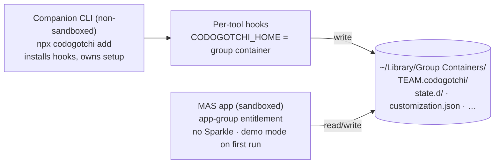

> Goal: everything you need to know about Mac App Store requirements, assuming
> you've never shipped there — and exactly where Codogotchi's current
> architecture collides with them. This is the primer behind the v3 roadmap's
> "App Store investigation" (Track 2); read it before promising the App Store
> to anyone. Sections end with 🗣️ plain-English recaps, per house style.
>
> Status note: Codogotchi ships today as a direct-download DMG. Nothing here
> is built; this chapter is the map of the gap.

---

## The two distribution worlds

macOS has two legitimate ways to ship an app:

| | **Developer ID** (what we do today, formalized in v3 Track 2) | **Mac App Store (MAS)** |
| --- | --- | --- |
| Gatekeeper trust | codesign + **notarization** (automated malware scan) | **App Review** (humans + rules) |
| Sandbox | optional | **mandatory** |
| Updates | your job (Sparkle) | the App Store's job (Sparkle **forbidden**) |
| Payments | your job (or free) | Apple IAP, 15–30% cut, required for digital goods |
| Install UX | download DMG, drag to /Applications | one-click, users already trust it |
| Who can ship | anyone with a $99/yr Apple Developer account | same account + passing review |

These are **separate builds with separate signing identities** ("Developer ID
Application" vs "Apple Distribution" certificates). Most apps that do both
maintain two build configurations from one codebase.

🗣️ **In plain English.** Selling outside the App Store is like selling at a
farmers' market — you need a health certificate (notarization) but you run
your own stall. The App Store is a supermarket: huge foot traffic, but the
store inspects your product, dictates the packaging, takes a cut of sales,
and *requires* your product be tamper-proof-wrapped (the sandbox).

---

## The App Sandbox — the rule that actually bites

Sandboxed apps run inside a **container**. The OS lies to them about the
filesystem: `~` resolves to
`~/Library/Containers/<bundle-id>/Data/`, not your real home. Outside the
container, a sandboxed app can only touch:

1. **Files the user explicitly picks** in an open/save panel — persistable
   across launches via *security-scoped bookmarks*.
2. **App Group containers** (`~/Library/Group Containers/<team-id>.…/`) —
   shared between programs signed by the same team.
3. Whatever narrow **entitlements** App Review accepts (network client,
   user-selected files, etc. — the "temporary exception" entitlements that
   once allowed broad home access are effectively dead on review).

Also forbidden or moot: installing anything outside your bundle (no writing
to `/usr/local/bin`, no editing other apps' files), loading Sparkle (updates
belong to the store), most process-spawning outside your own bundle.

🗣️ **In plain English.** A sandboxed app lives in a sealed apartment. It can
see its own rooms, rooms the user personally unlocks, and a shared laundry
room it can split with sibling apps from the same developer. It cannot wander
into other apps' apartments — which is a problem, because installing
Codogotchi's hooks is *exactly* "wandering into other apps' apartments."

---

## Where Codogotchi collides, point by point

Hold Chapter 09's producer/consumer split and Chapter 17's disk contract in
mind. The collisions, worst first:

### 1. Hook installation writes into other apps' config *(hard collision)*

Onboarding installs hooks by editing other tools' settings (Claude Code,
Cursor, VS Code, Codex, Antigravity config files under `~/.claude`,
`~/.cursor`, …). A sandboxed app **cannot do this, full stop** — no
entitlement exists for "edit another app's dotfiles," and asking the user to
open-panel-bless five hidden directories is a review-bait UX disaster.

**The only viable shape:** the *app* doesn't install hooks. A separate,
non-sandboxed **companion CLI** (`npx codogotchi add`, brew, or the existing
`packages/cli-npm`) owns hook installation — it already exists and already
does this. The MAS build's onboarding becomes "run this one command in a
terminal," like Docker Desktop or many dev tools do.

### 2. `~/.codogotchi` itself *(hard collision, clean solution)*

The whole contract lives in `~/.codogotchi` (Chapter 17). Inside the sandbox,
the app reading `~/.codogotchi` would silently read
`…/Containers/…/Data/.codogotchi` — an empty directory — while the hooks keep
writing to the *real* one. Producer and consumer would each see a different
"home" and the pet would sit idle forever. This is the subtle one: **nothing
errors; it just doesn't work.**

Two legal fixes:

- **App Group container (recommended).** Move the contract directory to
  `~/Library/Group Containers/<team-id>.codogotchi/` for the MAS build. The
  sandboxed app gets it via the app-group entitlement; the hooks — plain
  non-sandboxed processes — can write anywhere, so they just need the path.
  And the plumbing for that *already exists*: every path in the contract
  resolves through `CodogotchiFolders` / `CODOGOTCHI_HOME` (Ch.17), so the
  CLI writing hooks that set `CODOGOTCHI_HOME` to the group container is a
  configuration change, not a rewrite.
- **Security-scoped bookmark.** First launch shows an open panel pointed at
  `~/.codogotchi`; the user clicks once; the app stores a bookmark and keeps
  real access across launches. Workable fallback, uglier onboarding, and
  review sometimes squints at "please bless this hidden folder."

### 3. Sparkle *(mechanical)*

The v3 Sparkle work (Track 2) must be excluded from the MAS target — store
apps update through the store. This is a build-configuration split, decided
early so the update-check code has one seam.

### 4. The pet gallery / marketplace *(business rule, not code)*

If the MAS build ever sells pets or unlocks anything digital, that **must**
go through Apple In-App Purchase (15–30% cut) — linking out to
codogotchi.app's own checkout from inside the app is the fastest rejection in
the book. Today's gallery is free, so this is dormant — but it constrains
future monetization of the MAS build specifically.

### 5. "Works on first launch" *(review rule)*

Reviewers run the app cold, with no AI tools installed. If they see a
menu-bar icon that does nothing, that's a metadata/minimal-functionality
rejection risk. The MAS build needs the demo mode (Ch.14's fixture driver) or
an obvious sample-pet experience reachable without any hook installed, plus
review notes explaining the companion CLI.

🗣️ **In plain English.** Five problems, in descending scariness: the app may
not touch other tools' settings (so a helper command in the terminal must do
that part); the app and the hooks must agree on where the shared folder
*is* (solvable with Apple's official "shared laundry room"); the
self-updater must stay out of the store build; if we ever sell pets in the
store build, Apple takes a cut and dictates the checkout; and the app must
demo something to a reviewer who has no AI tools at all.

---

## What *doesn't* collide (genuinely fine)

Worth naming, because the scary list above isn't the whole story:

- **Menu-bar-only apps** (`LSUIElement`) are ordinary and approvable.
- **Floating always-on-top panels** across Spaces — `NSPanel` at `.floating`
  level with our collection behaviors is normal API, no entitlement needed.
- **Timers, file watching, JSON, SpriteKit, notifications** — all vanilla.
- **Launch at login** via `SMAppService` — sandbox-friendly.
- **Network** (the gallery fetch, Convex) — just the `network.client`
  entitlement, routine.
- Reading/writing **inside** the group container — the entire Chapter 17
  contract works unchanged once the path moves.

🗣️ **In plain English.** The pet itself — the windows, the animation, the
polling — is completely App-Store-shaped already. Everything hard is about
*installation and money*, not about the product.

---

## The shape of a MAS-ready Codogotchi

Putting it together, the investigation's likely conclusion (pre-drawn so you
can attack it):

- One codebase, **two targets**: Developer ID (DMG + Sparkle, today's product)
  and MAS (sandboxed, app-group path, no Sparkle, IAP-or-free).
- The **CLI is the installer** for both worlds; MAS just makes it mandatory.
- `CODOGOTCHI_HOME` / `CodogotchiFolders` is the hinge — the whole disk
  contract relocates by changing one resolution rule per build.
- **Sequencing:** this lands *after* notarization and Sparkle (Track 2 steps
  1–2), and only if the two-target maintenance cost looks worth the
  distribution win. The roadmap deliberately ranks it last and droppable.

🗣️ **In plain English.** The plan isn't to bend the current app into the
store — it's to split one product into two flavors: the free-range version
you download from us (unchanged), and a store version that keeps the same
pet but moves the shared folder to Apple's approved spot and hands all
installation duties to a terminal command. If the upkeep of two flavors
outweighs the store's reach, we skip it with a clear conscience — that's a
legitimate outcome of the investigation, not a failure.

---

## 🧪 Prove it to yourself

1. **See the container lie.** Sandbox any toy app (or read up on
   `NSHomeDirectory()` under sandboxing) and print `NSHomeDirectory()` —
   confirm it's the container path, not `/Users/you`. Now re-read Chapter 17
   and name every path that would silently break.
2. **Find the hinge.** In `CodogotchiFolders.dataFolderURL()`, confirm every
   contract path already resolves through one function honoring
   `CODOGOTCHI_HOME`. Sketch the MAS-build override (group container id in,
   env var out) in three lines.
3. **Audit the onboarding.** List every write `OnboardingWindowController` /
   the hooks installer performs outside `~/.codogotchi`. Each one is a thing
   the MAS app must delegate to the CLI. That list *is* the migration ticket.
4. **Steelman skipping MAS.** Given Homebrew cask + notarized DMG + Sparkle
   (Track 2 steps 1–2 and 4), argue the case that MAS adds distribution the
   target audience (developers with terminals) doesn't need. If that argument
   convinces you, you've understood why the roadmap ranks it last.
